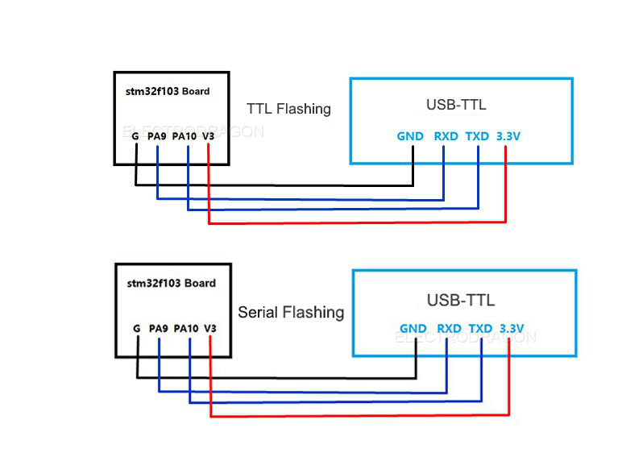
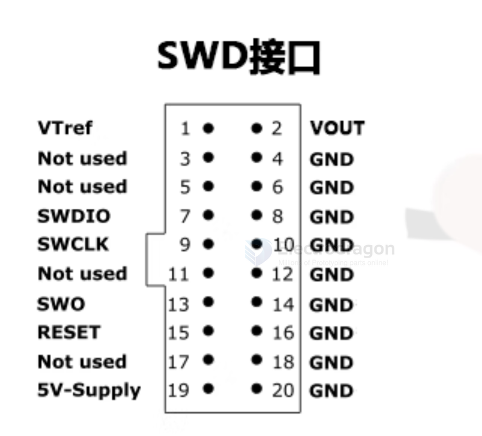
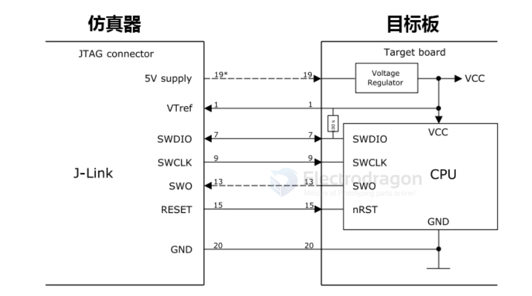

# SWD-dat

- [[st-link-dat]]

- https://static.docs.arm.com/ihi0031/d/debug_interface_v5_2_architecture_specification_IHI0031D.pdf
- https://www.arm.com/files/pdf/Serial_Wire_Debug.pdf

https://stm32-base.org/guides/connecting-your-debugger.html

## connect to DA14585 

- [[DA14585-dat]]

For basic SWD programming/debugging, the minimum required connections are:

- SWDCLK -> Debug clock
- SWDIO -> Debug data
- VCC -> Target power supply (or reference voltage)
- GND -> Ground

### Additional Recommendations

1. **NRST (Reset)** – Optional but recommended:
   - Allows the debugger to reset the chip during programming or debug sessions.
   - Some programmers/debuggers can operate without it, but including it improves reliability.

2. **Power Considerations**:
   - Ensure your SWD programmer/debugger voltage level matches the DA14585 I/O voltage (usually 1.8V–3.3V).

3. **Pull-ups/Pull-downs**:
   - Verify if SWDIO/SWDCLK lines need pull-ups; some boards already include them.

**Summary**:  
- **Required**: `SWDCLK + SWDIO + VCC + GND`  
- **Recommended**: Add `NRST` for better stability and full debug control.

## pins 

simplified connectors 

- Vtref 
- SWDIO
- SWCLK
- GND 

simplified connectors V2

- Vtref
- SWDIO
- SWCLK
- SWO
- NRST
- GND

simplified connectors V3

- Vtref - Vtref 
- NRST - NRST 
- TDO - TDI
- P8 - TMS
- GND - TCK 

CONN 3 

- GND
- TCK
- RTCK 

## wiring 

供电方式一般有三种：

- 1，使用5V-supply引脚经过目标板的LDO给McU供电。
- 2，直接将VOUT引I脚连接到MCU的VCC进行供电
- 3，用户也可以选择目标板自带供电。
- 注意：无论那种供电方式，VTREF引I脚都必须连接到MCU的VCC。

## Debug

* If SWD Serial-Wire is not enable, add reset line to force enter into debug mode

- [[USB-TTL-dat]]

- [[stm32-dat]]