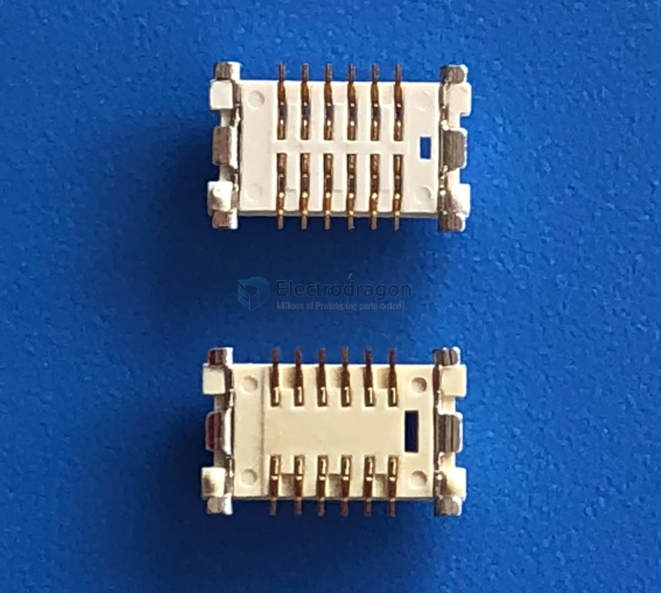
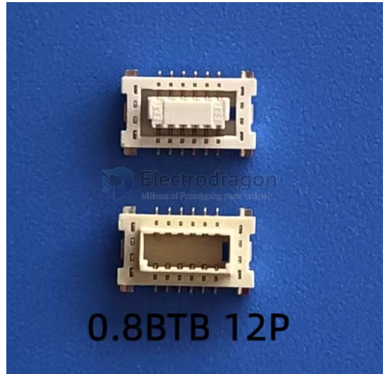
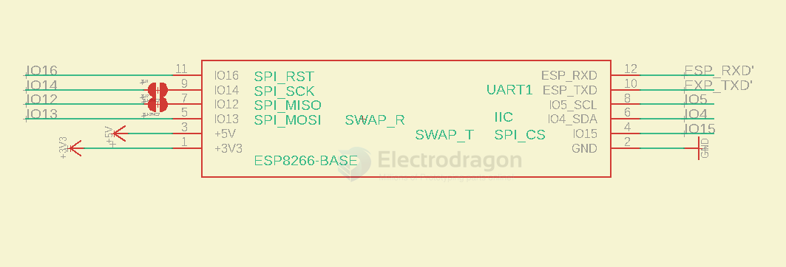
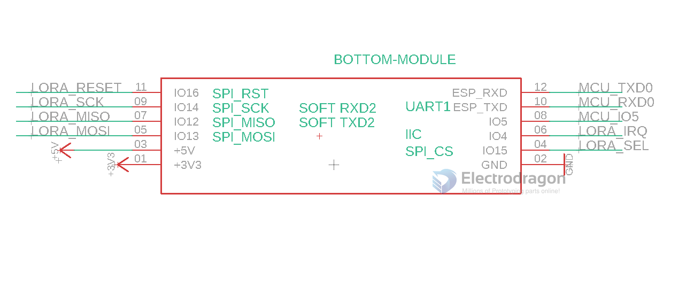
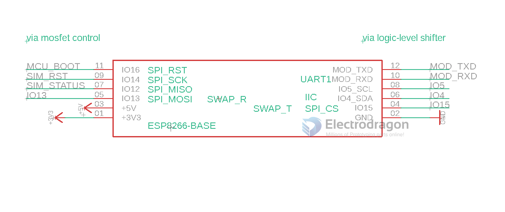
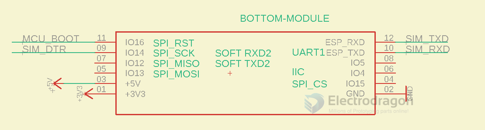

# 12P-BTB-dat

- [[ESP32-SPI-dat]]

mount the concave part on the bottom, and convex part on the top

https://www.electrodragon.com/w/ED-BTB

## BTB 12 pins connector 

| ESP32 Pin | Function | Lora       |
| --------- | -------- | ---------- |
| IO14      | SPI_SCK  |            |
| IO12      | SPI_MISO |            |
| IO13      | SPI_MOSI |            |
| IO15      | SPI_CS   |            |
| IO4       | IO       | LORA_IRQ   |
| IO27      | IO       | LORA_RESET |

general wiring 

| -       | -   | -            | -       | -       | -    | -    |
| ------- | --- | ------------ | ------- | ------- | ---- | ---- |
| func    | 3V3 | -            | -       | -       | -    | -    |
| ESP8266 | 3V3 | 5V / IO0 (u) | io13    | io12    | io14 | io16 |
| conn.T  | 1   | 3            | 5       | 7       | 9    | 11   |
| conn.B  | 2   | 4            | 6       | 8       | 10   | 12   |
| ESP8266 | GND | io15(d)      | io4 (u) | io5 (u) | RXD  | TXD  |
| func    | GND | -            | -       | -       | -    | -    |

- 1x 4-line [[SPI-dat]] + 5x [[GPIO-dat]]
- 1x 4-line [[SPI-dat]] + 1x [[Serial-dat]] + 1x [[I2C-dat]] + 1x [[GPIO-dat]]
- 1x 4-line [[SPI-dat]] + 1x [[Serial-dat]] + 3x [[GPIO-dat]]

- [[ESP8266-HDK-dat]] - [[ESP-12F-dat]] - [[SPI-dat]]

- [[LORA-HDK-dat]] - [[SX1262-MD1-dat]] - [[SX1262-HDK-dat]] - [[Lora-SDK-dat]]

## wiring for [[SX1262-dat]] 

V2 

|         | 1   | 2      | 3        | 4        | 5       | 6      |
| ------- | --- | ------ | -------- | -------- | ------- | ------ |
| func    | 3V3 | RESET  | SPI_MOSI | SPI_MISO | SPI_SCK | BUSY   |
| ESP8266 | 3V3 | IO0    | io13     | io12     | io14    | io16   |
| conn.L  | 1   | 3      | 5        | 7        | 9       | 11     |
| conn.R  | 2   | 4      | 6        | 8        | 10      | 12     |
| ESP8266 | GND | io15   | io4      | io5      | RXD     | TXD    |
| func    | GND | D1_IRQ |          |          | serial  | serial |

V1 

|         | 1   | 2        | 3        | 4        | 5       | 6      |
| ------- | --- | -------- | -------- | -------- | ------- | ------ |
| func    | 3V3 | DIO1_irq | SPI_MOSI | SPI_MISO | SPI_SCK | BUSY   |
| ESP8266 | 3V3 | IO0      | io13     | io12     | io14    | io16   |
| conn.L  | 1   | 3        | 5        | 7        | 9       | 11     |
| conn.R  | 2   | 4        | 6        | 8        | 10      | 12     |
| ESP8266 | GND | io15     | io4      | io5      | RXD     | TXD    |
| func    | GND | SPI_CS   | RXEN     | TXEN     | serial  | serial |

## connectors 

- total height = 3.0
- 12P, 0.8mm pitch 

top is "plug", bottom is the "base"

## BOT PLUG board 

- [[ESP32-dat]] - [[ESP32-Socket-Energy-dat]]

- [[DAR1060-dat]]

- [[NWI1230-dat]] == [[ESP8266-dat]]

## TOP Base board module board

- [[NGS1128-DAT]] == [[SIM7080-dat]]

- [[SX1262-MD1-dat]] - [[SX1262-dat]]

## attach board ref 

### lora

- [[Lora-dat]] - [[ESP32-SPI-dat]]

- use UART as main interface 

### SIM7020 

- use UART as main interface 

### SIM7080

- [[NGS1128-dat]]
- removed, due to less popular 

