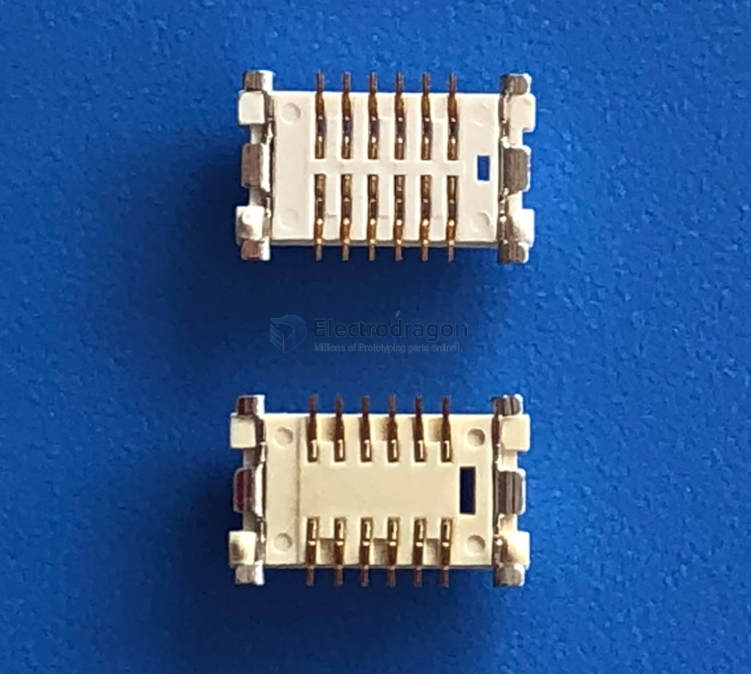
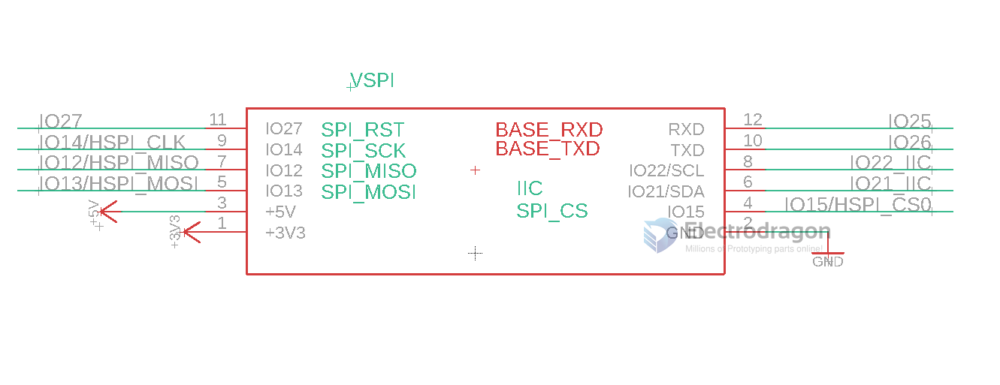
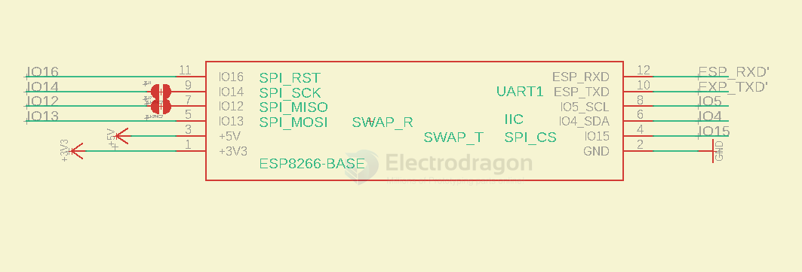

# BTB dat 

- [[FPC-dat]]

- [[ESP32-SPI-dat]]

mount the concave part on the bottom, and convex part on the top

https://www.electrodragon.com/w/ED-BTB

## BTB 12 pins connector 

| ESP32 Pin | Function | Lora       |
| --------- | -------- | ---------- |
| IO14      | SPI_SCK  |            |
| IO12      | SPI_MISO |            |
| IO13      | SPI_MOSI |            |
| IO15      | SPI_CS   |            |
| IO4       | IO       | LORA_IRQ   |
| IO27      | IO       | LORA_RESET |

general wiring 

| ESP8266 | func     | conn.L | conn.R | func         | ESP8266 |
| ------- | -------- | ------ | ------ | ------------ | ------- |
| io16    | IO0      | L-1    | R-1    | serial / IO5 | TXD     |
| io14    | SPI_SCK  | L-2    | R-2    | serial / IO4 | RXD     |
| io12    | SPI_MISO | L-3    | R-3    | SCL / IO3    | io5     |
| io13    | SPI_MOSI | L-4    | R-4    | SDA / IO2    | io4     |
| +5V     | power    | L-5    | R-5    | SPI_CS       | io15_d  |
| 3V3     | power    | L-6    | R-6    | power        | GND     |

- 1x 4-line [[SPI-dat]] + 5x [[GPIO-dat]]
- 1x 4-line [[SPI-dat]] + 1x [[Serial-dat]] + 1x [[I2C-dat]] + 1x [[GPIO-dat]]
- 1x 4-line [[SPI-dat]] + 1x [[Serial-dat]] + 3x [[GPIO-dat]]

- [[ESP8266-HDK-dat]]

- [[LORA-HDK-dat]] - [[SX1262-MD1-dat]] - [[SX1262-HDK-dat]]

wiring for [[SX1262-dat]]

| ESP8266 | func     | conn.L | conn.R | func   | ESP8266 |
| ------- | -------- | ------ | ------ | ------ | ------- |
| io16    | BUSY     | 11     | 12     | serial | TXD     |
| io14    | SPI_SCK  | 9      | 10     | serial | RXD     |
| io12    | SPI_MISO | 7      | 8      | TXEN   | io5     |
| io13    | SPI_MOSI | 5      | 6      | RXEN   | io4     |
| IO0     | DIO1_irq | 3      | 4      | SPI_CS | io15_d  |
| 3V3     | power    | 1      | 2      | power  | GND     |

rotate to fit physically

|                | 1         | 2         | 3         | 4         | 5         | 6         |
|----------------|-----------|-----------|-----------|-----------|-----------|-----------|
| ESP8266        | 3V3       | IO0       | io13      | io12      | io14      | io16      |
| func           | power     | DIO1_irq  | SPI_MOSI  | SPI_MISO  | SPI_SCK   | BUSY      |
| conn.L         | 1         | 3         | 5         | 7         | 9         | 11        |
| conn.R         | 2         | 4         | 6         | 8         | 10        | 12        |
| func           | power     | SPI_CS    | RXEN      | TXEN      | serial    | serial    |
| ESP8266        | GND       | io15_d    | io4       | io5       | RXD       | TXD       |

## connectors 

- total height = 3.0
- 12P, 0.8mm pitch 

## base board

- [[ESP32-dat]]

- [[NWI1230-dat]] == [[ESP8266-dat]]

- [[DAR1060-dat]]

## supported boards 

- [[NGS1128-DAT]] == [[SIM7080-dat]]

## attach board ref 

### lora

- [[Lora-dat]] - [[ESP32-SPI-dat]]

- use UART as main interface 

### SIM7020 

- use UART as main interface 

### SIM7080

- [[NGS1128-dat]]
- removed, due to less popular 

## ref 

- [[BTB]]