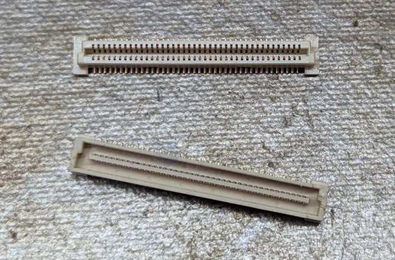

# BTB dat 

## common used 

- [[FPC-dat]] - [[mini-PCIE-dat]] - [[PCIE-dat]]

- [[M2-dat]]

- [[12P-BTB-dat]]

## UN-common used 

0.8mm 40P ~ 80P ~ 120P 

- [[DF40-dat]] == - commonly used for holding [[RPI-CM4-dat]]

- [[RPI-dat]]

## ref 

- [[BTB]]