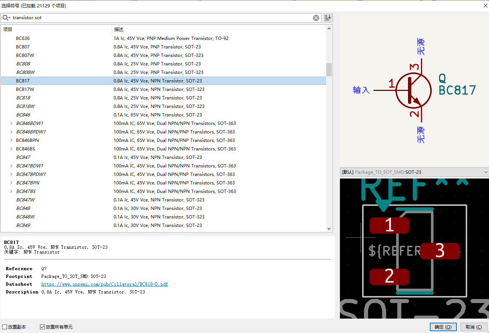

# kicad work flow 

- prerequisite shortcuts - https://docs.kicad.org/7.0/en/kicad/kicad.html

- add symbols and assign footprint 
  - enter "E" for properties, and assign the footprint 

## workflow SCH 

### add symbol 

- search based on components type and footprint

### assign the footprints

## workflow PCB

- [[kicad-pcb-dat]]

## ref 

- [[kicad-workflow]] - [[kicad]]