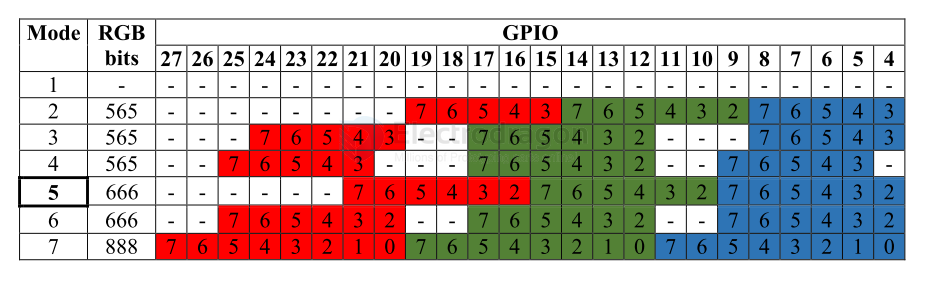

# DPI-dat

The DPI interface (which we use to make the VGA signal) can work in different colour modes. The default mode is 666 (6 Red, 6 Green, 6 Blue colours). 

Other supported formats are: 565 (5 Red, 6 Green, 5 Blue colours) and 888 (8 Red, 8 Green, 8 Blue colours). Also there are different ways in which the 666 and 565 colours bits can be output on the GPIO line. Please see the table below. 

You select the mode using: dpi_output_format=X (X in range 1..7) 
The VGA adaptor PCB is designed up for mode 5.  