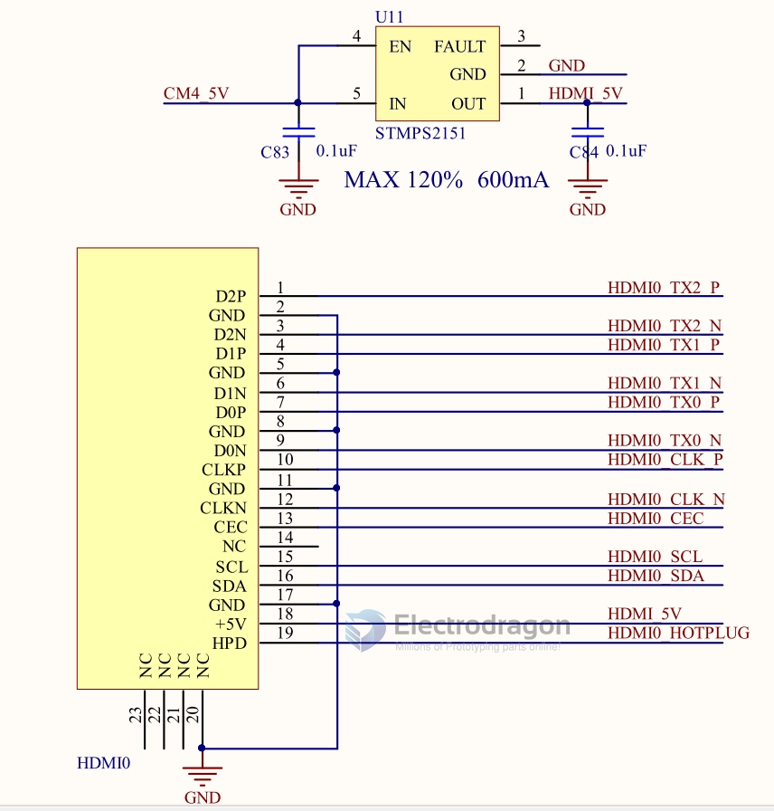
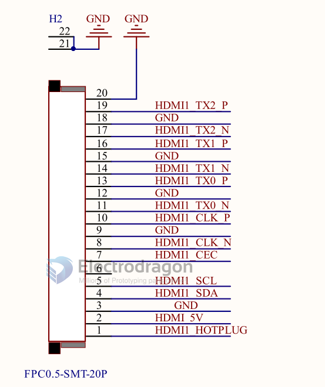
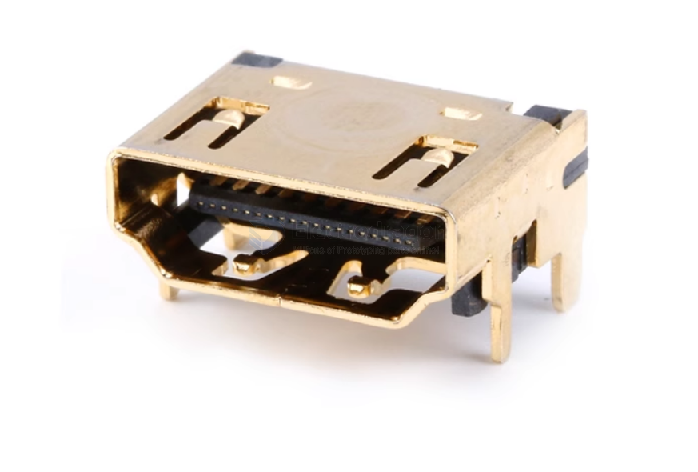
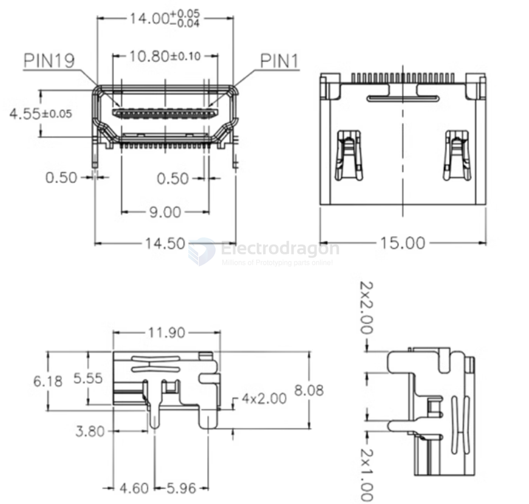
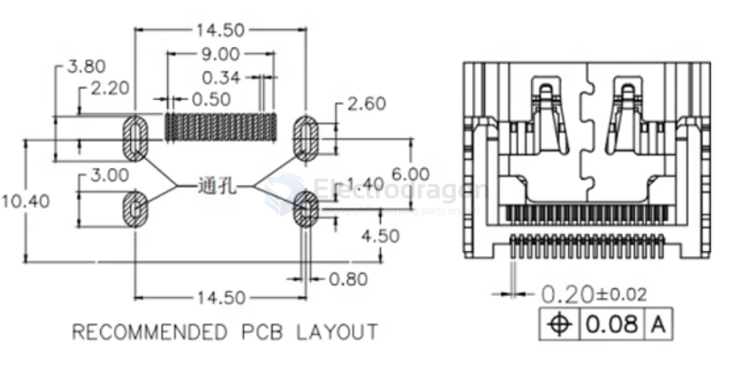
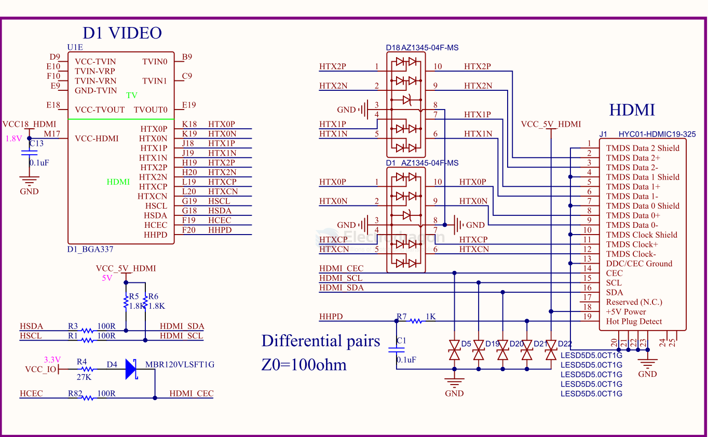

# HDMI-dat

## Pins 

HDMI_TX2_P
HDMI_TX2_N

HDMI_TX1_P
HDMI_TX1_N

HDMI_TX0_P
HDMI_TX0_N

HDMI_CLK_P
HDMI_CLK_N

HDMI_CEC

HDMI_SCL
HDMI_SDA

HDMI_5V

HDMI_HOTPLUG

## HDMI Connector 

## SCH 

wiring to [[D1-dat]] - [[F133-dat]]

## Display Interface 

- [[HDMI-dat]] - [[VGA-dat]] - [[DVI-dat]]

- [[audio-dat]]