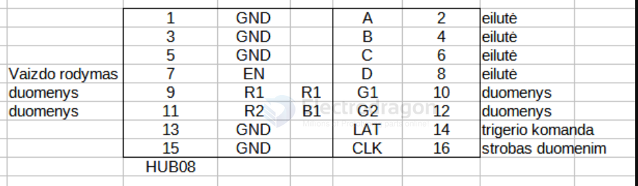

# HUB08-dat

| L-pin | Function | R-pin | Function |
| ----- | -------- | ----- | -------- |
| 1     | GND      | A     | 2        |
| 3     | GND      | B     | 4        |
| 5     | GND      | c     | 6        |
| 7     | EN       | D     | 8        |
| 9     | R1 / R1  | G1    | 10       |
| 11    | R2 / B1  | G2    | 12       |
| 13    | GND      | LAT   | 14       |
| 15    | GND      | CLK   | 16       |

## ref 

https://www.savel.org/2022/08/03/hub08-led-board-matrix-display-protocol-and-interface-to-stm32f103/

