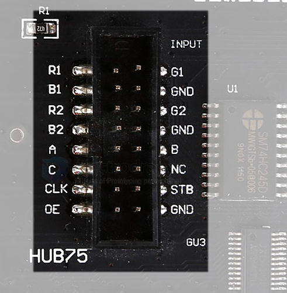
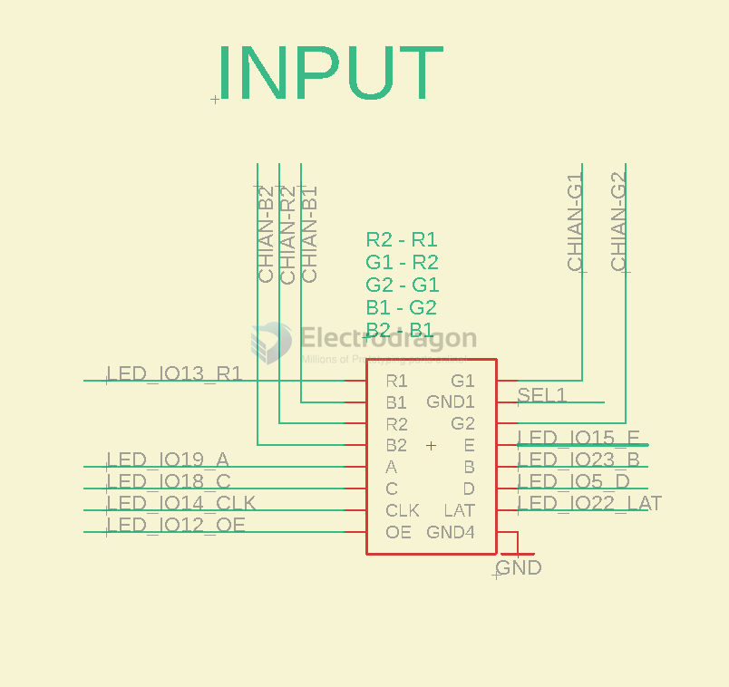

# HUB75 DAT 

## HUB75 with logic shifter on channel 0

## Real input connector 

## Input 

## template 

| Pin | Function    | Pin | Function    |
| --- | ----------- | --- | ----------- |
|     | R1          |     | G1          |
|     | B1          |     | GND (SEL)   |
|     | R2          |     | G2          |
|     | B2          |     | GND (E)     |
|     | A           |     | B           |
|     | C           |     | D           |
|     | CLOCK       |     | LATCH / STB | F |
|     | OE / ENABLE |     | GND         |

- [[MPC1120-dat]] - [[MPC1119-dat]] - [[MPC1073-dat]]

| ESP32DEV | Function    | ESP32DEV | Function    |
| -------- | ----------- | -------- | ----------- |
| 25       | R-1         | 26       | G-1         |
| 27       | B-1         | GND or E | GND (SEL)   |
| 14       | R-2         | 12       | G-2         |
| 13       | B-2         | 32 / 18  | GND (E)     |
| 23       | A           | 19       | B           |
| 5        | C           | 17       | D           |
| 16       | CLOCK       | 4        | LATCH / STB |
| 15       | OE / ENABLE |          | GND3        |

In some HUB75 variants, "SEL" (Select) may be used to enable or select specific rows or features, but in most standard HUB75 pinouts, this pin is simply a ground (GND) connection.

The LATCH / STB pin on a HUB75 RGB matrix display is used to latch (store) the row data into the display's internal registers. When you send pixel data for a row, you pulse the LATCH/STB pin to signal the display to capture and hold that data. This ensures the correct row is displayed when the output is enabled. "STB" stands for "Strobe," which is another term for this latching action. In summary, it synchronizes the transfer of row data from the controller to the display.