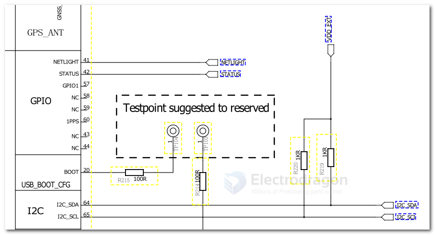

# I2C Dat 

- [[I2C-SDK-dat]] - [[interface-SDK-dat]]

## common I2C devices address 


// I2C device found at address 0x40  !  // INA219, INA226

for [[IOD1001-dat]]

for [[ESP32-CAM-dat]]
//I2C device found at address 0x3C  ! // OLED = 0x78
//I2C device found at address 0x75  ! // IP5306
//I2C device found at address 0x76  ! // BME280


// I2C device found at address 0x1F  ! // KX023
// I2C device found at address 0x38  ! // AHT20


## tech 

- [[I2C-switch-dat]] - [[qwiic-dat]]

## Boards 

- [[MPC1029-dat]] - [[MPC1083-dat]] - [[PCM5122-RPI-dat]]

- [[AHT20-dat]] - [[KX023-1025-dat]]

- [[INA226-dat]] - [[OLED-dat]]

- [[NBL1107-dat]]

- [[trim-dat]] - [[resistor-dat]] - [[digital-pot-dat]]


## Set custom I2C 

    Wire.begin(I2C_SDA, I2C_SCL);

testing scan I2C
    Wire.begin(4,13);
    Wire.begin(2, 3);

## I2C usage in Micropython 

- [[micropython-dat]]

    from machine import I2C, Pin

    # Define I2C on GPIO 15 (SDA) and GPIO 13 (SCL)

    i2c = I2C(0, scl=Pin(13), sda=Pin(15), freq=400000)
    i2c = I2C(0, scl=Pin(13), sda=Pin(15), freq=100000)


    print("I2C scan:", i2c.scan())


## command line readout 

Command Line Readout

With the included i2cdump and i2cget tools it is possible to read data out from a shell. The dump reads a range of bytes, here again 

with -y to disable interactive confirmation, range 0x02-0x2d for the standard registers, 

bus 0 and address 0x55. W for 16 bit words, because the chip returns directly 2 bytes, no need to send request for every single address.

```
orangepipc2:~:# i2cdump -y -r 0x02-0x2d 0 0x55 W
     0  1  2  3  4  5  6  7  8  9  a  b  c  d  e  f    0123456789abcdef
00:       00 00 ff ff 71 0b 66 0f 80 01 13 06 27 09      ....q?f???????
10: 02 05 16 08 00 00 ff ff ff ff ff ff ff ff 8a f8    ????..........??
20: 28 00 46 12 00 00 ff ff 6f 0b c0 03 3e 00          (.F?....o???>.  

orangepipc2:~:# i2cget -y 0 0x55 0x08 w
0x0f66

orangepipc2:~:# i2cget -y 0 0x55 0x2c w
0x003e
```


## code library 

the most easy to use library for ESP
- https://github.com/ThingPulse/esp8266-oled-ssd1306


## circuits 

- common pullup resistors 1K/4.7K/10K



## setup for RPI I2C 

Driver Installing

1.Enable Raspberry Pi I2C. Skip this step if it is already enabled. Open terminal and input the following commands and press "Enter":

    pi@raspberrypi:~ $ sudo raspi-config

Then use the UP/Down keys to select "5 Interfacing Options", press Enter, select "P5 I2C" and press Enter to comfirm "Yes". Restart the Raspeberry Pi board.

2.To install Python dependency library and git, the Raspberry Pi needs to be networked. Skip this step if already installed. In the terminal, input the following commands and press Enter:

    pi@raspberrypi:~ $ sudo apt-get update pi@raspberrypi:~ $ sudo apt-get install build-essential python-dev python-smbus git

3.Download the DFRobot_CH423 driver library. In the terminal, type the following commands and press Enter:

    pi@raspberrypi:~ $ cd Desktop/ `pi@raspberrypi:~/Desktop $ git clone https://github.com/DFRobot/DFRobot_CH423


### I2C scan in RPI 

install scan 

    sudo apt-get install -y i2c-tools

scan 
    i2cdetect -y 1

test

Write data to the PCM5122 registers (replace 0x4C with the correct I2C address):

    i2cset -y 1 0x4C <register> <value>

Read data from the PCM5122:

    i2cget -y 1 0x4C <register>


## code 

initiate check 

    while(!bme.begin())
        {
            Serial.println("Could not find BME280 sensor!");
            delay(1000);
        }

 custom I2C address 

    // Initialize the sensor with the custom I2C address (0x76 or 0x77)
    if (!bmp280.begin(0x76)) // Use 0x76 or 0x77 depending on your sensor's address
    {
        Serial.println("Could not find BMP280 sensor!");
        delay(1000);
    }
  


## pin arrangement 

- [[MPU6050-dat]]

- SDA
- SCL
- GND
- +5V 


## ref 

- https://randomnerdtutorials.com/esp32-i2c-communication-arduino-ide/#1


- [[logic-level-shifter-dat]]


- [[arduino-dat]]

- [[I2C-scan-dat.ino]]