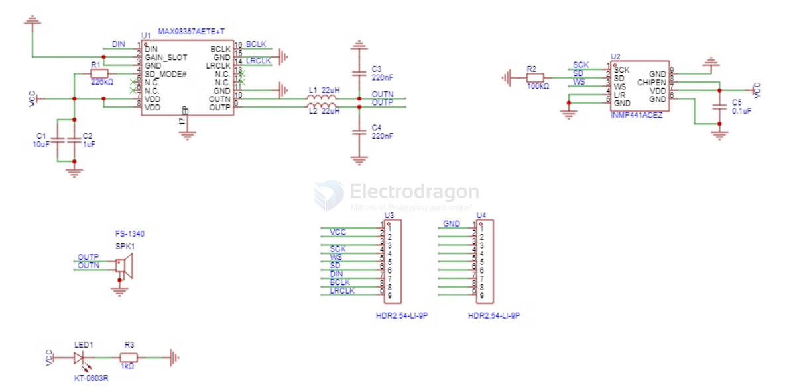

# I2S-dat 

An I2S (Interactive Two-Way Serial) interface is a type of serial communication protocol used for transferring data between devices. 

It is commonly used in computer networking, as well as in audio processing and digital electronics. 

I2S interfaces typically use a combination of fast and slow data transfer rates to make efficient use of communication bandwidth and minimize noise and errors. 

One of the key features of I2S interfaces is their ability to support full-duplex communication, which allows for the simultaneous transfer of data in both directions. 

This makes I2S a popular choice for high-speed data transfer applications.

- [[I2S-microphone-dat]] - [[I2S-speaker-dat]]

- [[everest-semi-dat]]

## Pin 

| Name | default ESP32 | also Name    | func                               | RPI GPIO | RPI pin |
| ---- | ------------- | ------------ | ---------------------------------- | -------- | ------- |
| SCK  | 26            | BCLK         | Serial Data Clock / Bit clock line | G18      | PIN 12  |
| WS   | 25            | LRCK / LRC   | Serial Data-Word select line       | G19      | PIN 35  |
| SD   | 22            | SDIN / SDOUT | At least one multiplexed data line | G21      | PIN 40  |

I2S Circuit:

* Arduino/Genuino Zero, MKR family and Nano 33 IoT
* MAX08357:
  * GND connected GND
  * VIN connected 5V
  * LRC connected to pin 0 (Zero) or 3 (MKR), A2 (Nano) or 25 (ESP32)
  * BCLK connected to pin 1 (Zero) or 2 (MKR), A3 (Nano) or 5 (ESP32)
  * DIN connected to pin 9 (Zero) or A6 (MKR), 4 (Nano) or 26 (ESP32)
 
 DAC Circuit:
 * ESP32 or ESP32-S2
 * Audio amplifier
   - Note:
     - ESP32 has DAC on GPIO pins 25 and 26.
     - ESP32-S2 has DAC on GPIO pins 17 and 18.
  - Connect speaker(s) or headphones.

## Common Microphone, Speaker Wiring 

## Other combine use with ESP32-S3 

## Solution - control (slave module)

- [[I2S-microphone-dat]]

audio amplifer - [[audio-dat]] - [[amplifier-dat]] - [[CS4344-dat]]

I2S speaker - [[PCM5122-dat]] - [[MPC1083-dat]] - [[MAX98357-dat]] - [[PCM5102-dat]] - [[AMP1006-dat]] 

- [[ES9023-dat]] - [[MPC1111-dat]] - [[ES9018-dat]]
  
- [[WM8960-dat]] - [[WM8978-dat]]

- [[UDA1334-dat]] - [[AMP1013-dat]]

- [[bt-audio-dat]] - [[ESP32-DAC-dat]] - [[ADC-dat]] - [[DAC-dat]] - [[ESP32-I2S-dat]]

- [[PCM1808-dat]]

- [[software-i2s-dat]]

## demo video 

- [[MAX98357-dat]] works with [[ESP32-dat]] - https://x.com/electro_phoenix/status/1877255863846465989

## code 

https://github.com/sheaivey/ESP32-AudioInI2S

https://github.com/atomic14/esp32_audio == [[platformIO-dat]]

https://github.com/schreibfaul1/ESP32-audioI2S == easy

https://github.com/earlephilhower/ESP8266Audio

## ref 

https://en.wikipedia.org/wiki/I%C2%B2S

- [[I2S]]

