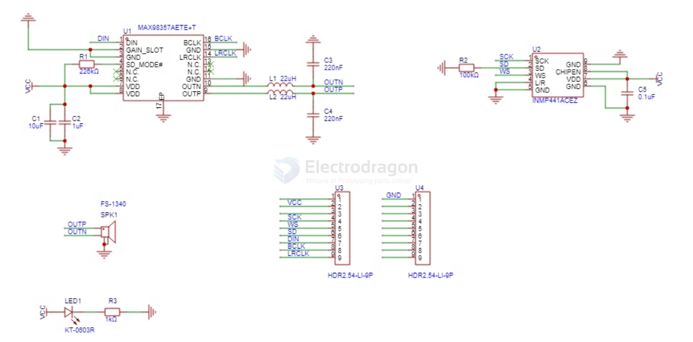

# I2S-dat 

## tech 

- [[DAC-dat]] - [[amplifier-audio-dat]] - [[speaker-dat]]

- [[I2S-microphone-dat]] 

- speaker == [[I2S-DAC-dat]]

- [[sensor-dat]] 

- [[ESP32-S3-dat]]

## info 

An I2S (Interactive Two-Way Serial) interface is a type of serial communication protocol used for transferring data between devices. 

It is commonly used in computer networking, as well as in audio processing and digital electronics. 

I2S interfaces typically use a combination of fast and slow data transfer rates to make efficient use of communication bandwidth and minimize noise and errors. 

One of the key features of I2S interfaces is their ability to support full-duplex communication, which allows for the simultaneous transfer of data in both directions. 

This makes I2S a popular choice for high-speed data transfer applications.

### 1. Pin Mapping Logic

To get this working, you simply need to map your microphone's pins to the ESP32’s I2S peripheral. Here is how they correspond:

| Microphone Label | I2S Standard Name | ESP32 Function | Role |
| :--- | :--- | :--- | :--- |
| **CLK** (or BCLK) | **SCK** (Bit Clock) | Output | The heartbeat that times every individual bit. |
| **L/R** (or WS) | **WS** (Word Select) | Output | Toggles to define the start of Left/Right frames. |
| **DATA** (or SD) | **SDIN** (Data In) | Input | The digital audio stream entering the ESP32. |

### 2. Why "MCLK" is Missing

If you are looking at ESP32 documentation, you might see a fourth signal called **MCLK (Master Clock)**. 
* **The Good News:** Most I2S MEMS microphones (like the INMP441 or SPH0645) do **not** require an MCLK signal. They derive their internal timing directly from the Bit Clock (CLK).
* **The Setup:** You can simply leave the MCLK configuration in your code as "unused" or -1.

### WS pin 

The WS pin stands for Word Select. In the I2S (Inter-IC Sound) protocol, it is the signal that manages the timing and "addressing" of the audio data bits.

Think of it as the toggle switch that tells the receiver (like your ESP32) whether the data currently arriving belongs to the Left channel or the Right channel.

That is correct. The WS pin (Word Select) is absolutely mandatory for I2S communication. You cannot skip it, leave it floating, or tie it directly to a constant voltage (GND/3.3V).

If you skip the WS pin, the ESP32 will have no way of knowing:

When a "word" (an audio sample) starts. Without a sync signal, the data just looks like a random, infinite string of bits.

Which bit is the Most Significant Bit (MSB). Audio data is usually 16, 24, or 32 bits long. WS tells the ESP32 to "start counting" bits for a new sample.

Other Common Names for WS

Depending on the datasheet for your microphone or DAC, you might see the WS pin labeled as:

- LRCLK (Left/Right Clock)
- FS (Frame Sync)
- LRCK

## chips and chips 

- [[everest-semi-dat]]

- [[ES9023-dat]] - [[MPC1111-dat]] - [[ES9018-dat]]

- [[PCM5121-dat]]

PCM512x 2-VRMS DirectPath™ , 112-dB and 106-dB Audio Stereo DACs With 32-Bit, 384-kHz PCM Interface

- [[PCM5122-dat]] - [[MPC1083-dat]]

## Other combine use with ESP32-S3 

## demo video 

- [[MAX98357-dat]] works with [[ESP32-dat]] - https://x.com/electro_phoenix/status/1877255863846465989

## code 

https://github.com/sheaivey/ESP32-AudioInI2S

https://github.com/atomic14/esp32_audio == [[platformIO-dat]]

https://github.com/schreibfaul1/ESP32-audioI2S == easy

https://github.com/earlephilhower/ESP8266Audio

## Micropython driver 

- [[Micropython-dat]]

- [[I2S-DAC-dat]] driver 

https://github.com/miketeachman/micropython-i2s-examples

- [[I2S-microphone-dat]] driver 

#ESP32 I2S MEMS Microphone Arduino IDE Example This repository holds some samples for connecting a I2S MEMS microphone to an ESP32 board.

https://github.com/miketeachman/micropython-i2s-examples

## ref

audio amplifer - [[audio-dat]] - [[amplifier-dat]] - [[CS4344-dat]]

- [[ES9023-dat]] - [[MPC1111-dat]] - [[ES9018-dat]]
  
- [[WM8960-dat]] - [[WM8978-dat]]

- [[bt-audio-dat]] - [[ESP32-DAC-dat]] - [[ADC-dat]] - [[DAC-dat]] - [[ESP32-I2S-dat]]

- [[PCM1808-dat]]

- [[software-i2s-dat]]

https://en.wikipedia.org/wiki/I%C2%B2S

- [[I2S]]

