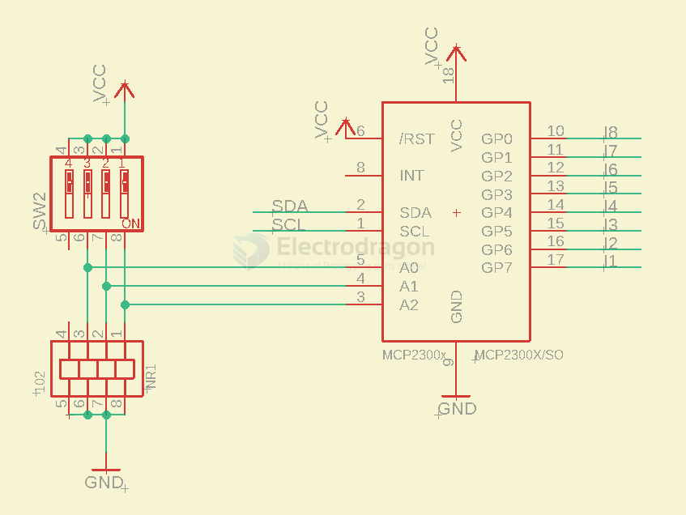
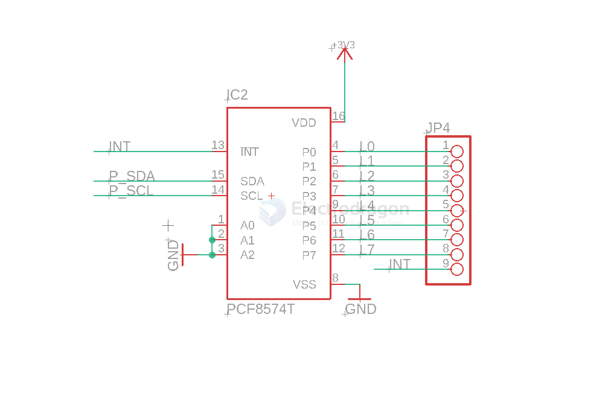

# IO-expander-dat

## boards 

- [[MSP1064-dat]]

## tech 

- [[PCF8574-dat]] - [[IO-expander-dat]] - [[MCP23008-dat]] - [[I2C-dat]]

- [[PCF8591-dat]]

## MCP23008 

## PCF8574 

## other 

- [[MCP23S08]]

PCA9555DBR - PCA9555 Remote 16-bit I2C and SMBus I/O Expander with Interrupt Output and Configuration Registers

## ref 

- [[I2C-dat]]

- [[io-expander]]