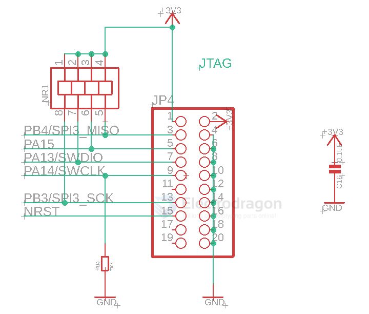

# JTAG-dat 

- [[ESP-Prog-dat]]

- [[openOCD-dat]]

Full Jtag Interface 

- VTref -- VOUT
- nTRST -- GND
- TDI -- GND
- TMS -- GND
- TCK -- GND
- RTCK -- GND
- TDO -- GND
- RESET -- GND
- DBGRQ -- GND
- 5V-Supply -- GND

## wiring 

power supply 

供电方式一般有三种：

- 1，使用5V-supply引脚经过目标板的LDO给McU供电。
- 2，直接将VOUT引I脚连接到MCU的VCC进行供电
- 3，用户也可以选择目标板自带供电。
- 注意：无论那种供电方式，VTREF引I脚都必须连接到MCU的VCC。

## repo 

- JLINK - https://github.com/Edragon/Jlink

## ref 

- [OpenOCD](http://openocd.org/)