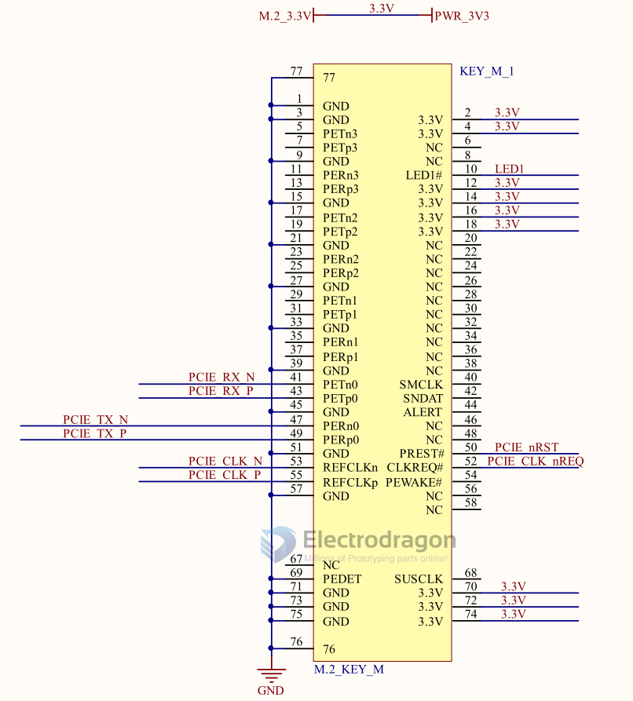
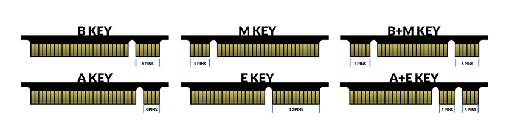

# M2-dat 

## type of M2 Key 

- M key == 2242 / 2260 / 2280 / 22110 == PCIe x4 + SATA
- B key == 2242 / 2260 / 2280 == PCIe x2 + USB 3.0
- A key == 2230 / 2242 / 2260 / 2280 == PCIe x2 + USB 3.0
- E key == 2230 / 2242 / 2260 / 2280 == PCIe x2 + USB 3.0 + I2C

- B+M key == 2242 / 2260 / 2280 == PCIe x2 + SATA + USB 3.0
- A+E key == 2230 / 2242 / 2260 / 2280 == PCIe x2 + USB 3.0 + I2C

## compare M2 Key with PCIE 

compare M2 Key with PCIE 

| M.2 Key | PCIe Lane | SATA | USB | I2C |
| ------- | --------- | ---- | --- | --- |
| M       | 4         | Yes  | No  | No  |
| B       | 2         | No   | Yes | No  |
| A       | 2         | No   | Yes | No  |
| E       | 2         | No   | Yes | Yes |
| B+M     | 2         | Yes  | Yes | No  |
| A+E     | 2         | No   | Yes | Yes |

compare M2 key with mini PCIE 

## ref 

- [[M2]]