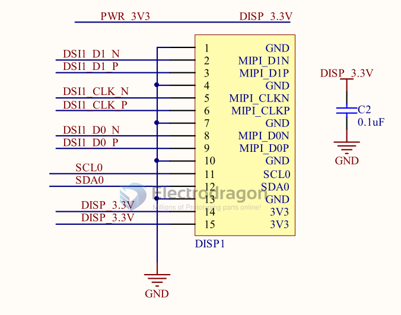

# DSI-dat 

MIPI serial display

**DSI** stands for **Display Serial Interface**.  

It’s a high-speed serial interface standard defined by **MIPI** (Mobile Industry Processor Interface) for connecting a display module (like an LCD or AMOLED panel) to a host device (like a smartphone SoC or single-board computer).

### MIPI-DSI  

1. **Physical Layer (D-PHY)**
   - Uses **1 clock lane + 1–4 data lanes** (each differential pair).
   - Two modes:
     - **Low-Power (LP) mode** → for commands & initialization (slow, ~10 Mbps).
     - **High-Speed (HS) mode** → for pixel streaming (up to ~1–6 Gbps per lane).

2. **Protocol Layers**
   - **Packet-based transmission**:
     - **Short packets** → commands, sync signals.
     - **Long packets** → pixel data for a line.
   - Works kind of like sending “frames” line by line over a high-speed serial link.

3. **Video Modes**
   - **Command Mode** → SoC sends drawing commands (used with display’s own RAM).
   - **Video Mode** → Continuous stream of pixel data (panel shows it directly).

4. **Key Advantages**
   - Fewer wires than parallel RGB.
   - High bandwidth for high-resolution displays.
   - Low EMI due to differential signaling.

📌 **Flow in simple terms**:  
**SoC** prepares pixel data → wraps it in DSI packets → sends over differential lanes (HS mode) → **Display controller** unpacks → drives LCD pixels.

## ref 

- [[display-dat]]

- [[display]]