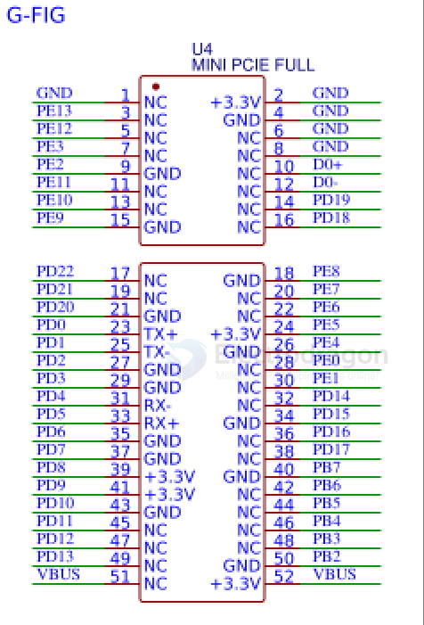
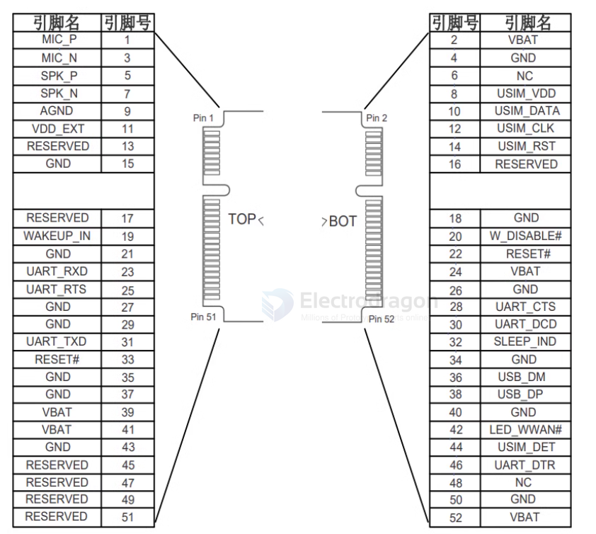

# PCIE-dat

- 52-pin

- [[F133-dat]]

## SCH 

## M2M Module 

| left      | pin | pin | right      |
| --------- | --- | --- | ---------- |
| MIC_P     | 1   | 2   | VBAT       |
| MIC_N     | 3   | 4   | GND        |
| SPK_P     | 5   | 6   | NC         |
| SPK_N     | 7   | 8   | USIM_VDD   |
| AGND      | 9   | 10  | USIM_DATA  |
| VDD_EXT   | 11  | 12  | USIM_CLK   |
| RESERVED  | 13  | 14  | USIM_RST   |
| GND       | 15  | 16  | RESERVED   |
| RESERVED  | 17  | 18  | GND        |
| WAKEUP_IN | 19  | 20  | W_DISABLE# |
| GND       | 21  | 22  | RESET#     |
| UART_RXD  | 23  | 24  | VBAT       |
| UART_RTS  | 25  | 26  | GND        |
| GND       | 27  | 28  | UART_CTS   |
| GND       | 29  | 30  | UART_DCD   |
| UART_TXD  | 31  | 32  | SLEEP_IND  |
| RESET#    | 33  | 34  | GND        |
| GND       | 35  | 36  | USB_DM     |
| GND       | 37  | 38  | USB_DP     |
| VBAT      | 39  | 40  | GND        |
| VBAT      | 41  | 42  | LED_WWAN#  |
| GND       | 43  | 44  | USIM_DET   |
| RESERVED  | 45  | 46  | UART_DTR   |
| RESERVED  | 47  | 48  | NC         |
| RESERVED  | 49  | 50  | GND        |
| RESERVED  | 51  | 52  | VBAT       |

## ref 

- [[interface-dat]]