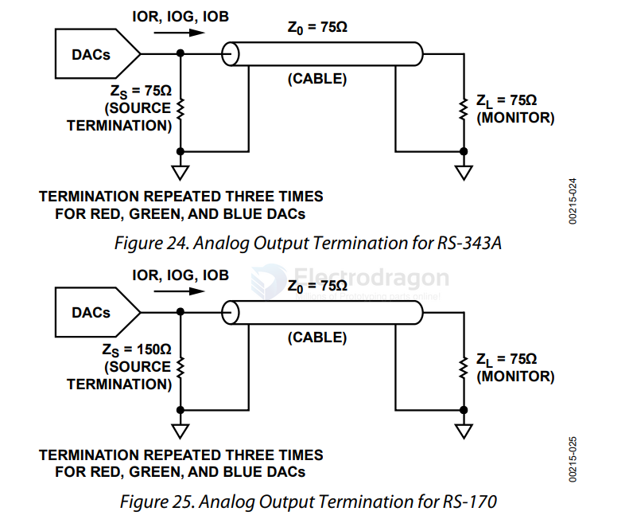

# RS170-dat

- [[RS170-dat]] - [[RS343-dat]] - [[interface-dat]] - [[video-dat]] - [[RS232-dat]]

RS-170 is a US EIA Recommended Standard (1957, later EIA-170) that defines a black-and-white analog composite video signal for closed-circuit / industrial / military use. It is the monochrome base of NTSC — the "R" prefix is the same EIA naming family as RS-232/RS-422/RS-485, but unlike those it is not a digital serial link, it is a 75 Ω analog video signal.

## Signal Characteristics

| Parameter        | Value                                                        |
| ---------------- | ------------------------------------------------------------ |
| Lines / field    | 525 lines, 2:1 interlace (262.5 lines per field)              |
| Frame rate       | 30 fps (60 fields/s)                                          |
| Line rate        | 15.75 kHz (63.556 µs per line)                                |
| Signal amplitude | 1 V p-p into 75 Ω                                             |
| Levels           | sync tip −0.3 V, blanking 0 V, white +0.7 V (negative-going sync) |
| Video bandwidth  | ~4.2 MHz luma (NTSC M)                                        |
| Connector        | BNC coax, 75 Ω                                                |

## Variants and Related Standards

- **RS-170A** - adds the color burst + chroma subcarrier (3.579545 MHz); this is essentially NTSC (59.94 Hz field rate instead of 60 Hz).
- **RS-343** - higher-resolution monochrome (e.g. 875 or 1023 lines, higher line rate), used in military/avionics displays.
- **Sync / Genlock** - RS-170 specifies composite sync and often separate H/V drive signals, which is why the term appears in camera sync / genlock systems.
- **CVBS** - the generic name for a composite video signal of this type.

## Applications

- Machine vision cameras + frame grabbers (BNC "analog camera" inputs)
- CCTV legacy systems
- CRT monitors / test equipment (oscilloscopes with video trigger)
- Retro computing (Apple II, Commodore, early arcade boards)
- Old industrial / avionics displays

## Modern Relevance

Largely obsolete for new designs — replaced by digital interfaces (GigE Vision, USB3 Vision, LVDS, MIPI CSI, HDMI). It still matters when interfacing or refurbishing legacy equipment, and "RS-170" is frequently used loosely to mean any monochrome composite video with negative sync.

## ref 

