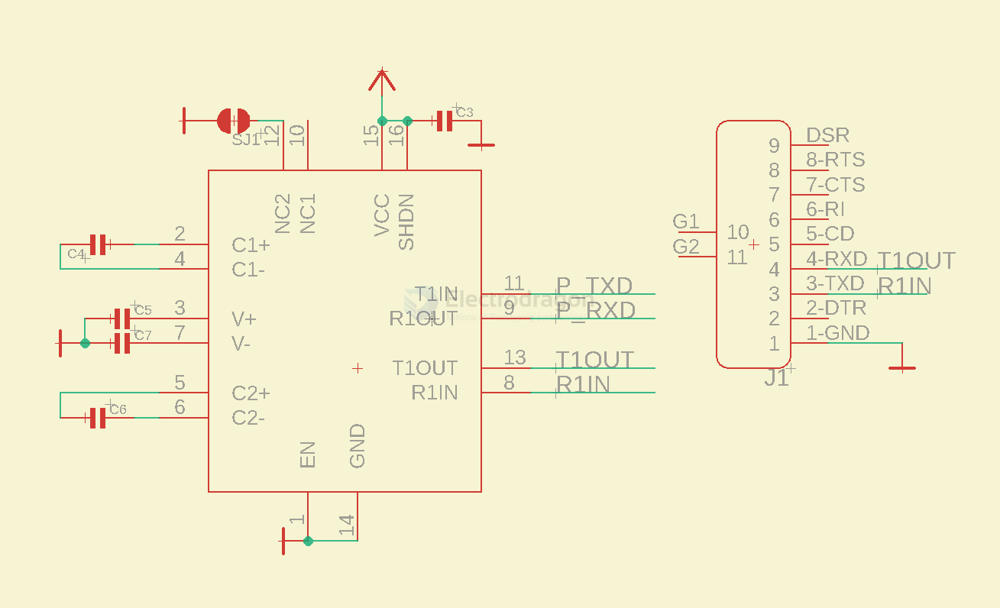

# RS232 DAT 

## Boards 

- [[MPC1098-dat]]

## Connectors 

Male Connector 

Male / Left and Female / Right Type Connector

A common Convert board

| male conn | male pin | female conn | female pin |
| --------- | -------- | ----------- | ---------- |
| pin2      | rxd      | pin3        | txd        |
| pin3      | txd      | pin2        | rxd        |
| pin5      | gnd      | pin5        | gnd        |

customized common: 
- pin 9 RI for Vin/Vout

标准DB-9插头 （母头）
- DB9插头和母头区别
- 公头的2引脚是RXD，母头的2引脚是TXD。5引脚是GND。
- 公头的3引脚是TXD，母头的3引脚是RXD。

## Typical Circuit 

- based on chip [[SP3220-dat]], supply voltage 3.3V for [[RPI-dat]]

## ref 

- [[DPR1084-dat]] - [[DPR1054-dat]] - [[DPR1073-dat]]

- [[DB9-dat]]

- [[RS232]]
