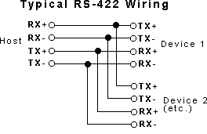

# RS422-dat

## Wiring

The following wiring should be correct for RS422 to RS422 

| RS422 pin | RS422 alias | target alias |target | 
| --------- | ----------- | ------------ |------ | 
| Y         | TXD+        | RXD-         |A      | 
| A         | RXD-        | TXD+         |Y      | 
| Z         | TXD-        | RXD+         |B      | 
| B         | RXD+        | TXD-         |Z      | 

this probably wrong or not P2P type 

- Y = TXD+ --- B = RXD+
- Z = TXD- --- A = RXD-
- B = RXD+ --- Y = TXD+
- A = RXD- --- Z = TXD-

| RS422 pin | RS422 alias | target alias |target | 
| --------- | ----------- | ------------ |------ | 
| Y         | TXD+        | RXD+         |B      | 
| Z         | TXD-        | RXD-         |A      | 
| B         | RXD+        | TXD+         |Y      | 
| A         | RXD-        | TXD-         |Z      | 

## Use with arduino

## Demo video 

- please refer to ESP32-ISO board 

## ref

https://en.wikipedia.org/wiki/RS-422
https://www.omega.com/en-us/resources/rs422-rs485-rs232

- [[DPR1097-dat]]

- [[RS422]]

