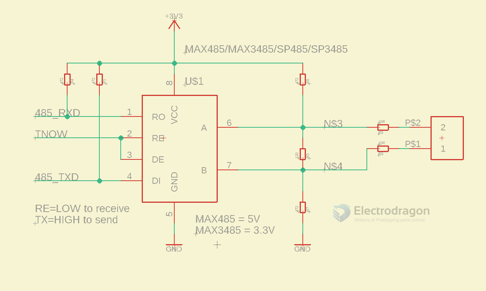

# RS485 DAT 

## interface 

- A
- B 

## current limiter 
- 24v ~ 30ma, need ~ 800ohms current-limiting resistor
- 3.3V ~ 4mA

## wiring 

## SCH 

## Debug 

- A / B reversed wiring = incorrect error data 

## Boards 

- [[DPR1060-dat]] - [[MSP1076-dat]]

- [[ITF1000-dat]]

- [[WCH-dat]]

## 🎥 Can You Send Analog Video via RS-485?

### ❌ Why You *Can't* Send Raw Analog Video Over RS-485

- RS-485 transmits **digital differential signals**
- Analog video (like composite) is a **broadband analog signal** (~6 MHz for NTSC)
- RS-485 is **not designed for high-frequency analog data**

---

### ✅ What You *Can* Do Instead

#### 1. **Analog Video Over Twisted Pair (Using Baluns)**
- Use **video baluns** to send composite video (CVBS) over twisted pair cable
- Reuses RS-485 cabling but **not the protocol**
- 🧭 **Range**: ~300–600 meters

#### 2. **Digitize Video, Then Send Over RS-485**
- Compress video (MJPEG or H.264) with a video encoder module
- Transmit via UART or RS-485 at **low resolution and frame rate**
- Works for basic camera modules in embedded systems

#### 3. **RS-485 for PTZ Control (Not Video)**
- Common in CCTV: RS-485 controls camera movement (pan-tilt-zoom)
- Video signal travels separately (e.g., via coax or UTP)
- Uses protocols like **Pelco-D**

---

### 📊 Summary Table

| Method                             | Video Type   | Uses RS-485 Protocol? | Distance      | Notes                            |
|------------------------------------|--------------|------------------------|---------------|----------------------------------|
| RS-485 directly                    | ❌ Not possible | ❌                    | N/A           | Insufficient bandwidth           |
| Balun over twisted pair            | ✅ Analog     | ❌ (cable only)        | ~300–600 m    | Uses RS-485 wiring, not signal   |
| Digital video over RS-485          | ✅ Digital    | ✅                    | ~100–1200 m   | Low res and frame rate only      |
| RS-485 for PTZ control only        | ❌ Control only | ✅                  | ~1200 m       | Standard for CCTV control        |

---

### 🧠 Tip

If your goal is **long-range video transmission**, consider:

- **Analog over balun** for simple systems
- **Ethernet over fiber or twisted pair** for high-quality video
- **Use RS-485 just for control**, not video transport

## ref 

- [[interface-dat]] - [[video-dat]]

- [[RS485]] - [[RS232]]