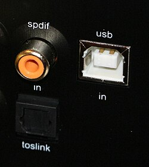

# SPDIF-dat

https://en.wikipedia.org/wiki/S/PDIF




## 🧪 SPDIF to TTL Interface Circuit (Basic Example)

This circuit converts a **coaxial SPDIF signal** into a **5V TTL-compatible digital signal** using basic analog components.

```text
         +5V
          │
         [10kΩ] R1
          │
SPDIF ▶──C1───┬────┬───► To Comparator Input (Vin+)
(Coaxial)     │   [10kΩ] R2
        (0.1µF)     │
                   GND

Comparator:
- Vin+  → From voltage divider (above)
- Vin−  → Reference voltage (e.g. 2.5V from voltage divider or regulator)
- Vout → 5V TTL output signal (to MCU / logic circuit)
```

### 🧰 Components:
- `C1`: 0.1 µF ceramic capacitor (AC coupling)
- `R1`, `R2`: 10kΩ resistors to create a bias voltage (~2.5V)
- **Comparator**: e.g. LMV7219, TLV3501 (fast response)
- Optional: Schmitt trigger buffer (e.g. 74HC14) for clean signal output

### ⚠️ Notes:
- Always AC-couple SPDIF input to protect from DC offsets.
- Adjust resistor values for different bias points if needed.
- For more reliable decoding, consider using a dedicated SPDIF receiver chip like `DIR9001` or `CS8416`.

