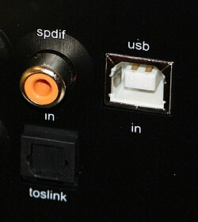

# SPDIF-dat


- [[Coax-dat]] - 75 ohm S/PDIF output stage

- [[toslink-dat]] 


https://en.wikipedia.org/wiki/S/PDIF



## 🎧 Is SPDIF Analog or Digital?

**SPDIF (Sony/Philips Digital Interface Format)** is a **digital** signal.

---

### 🔍 Quick Breakdown:
- ✅ **Digital audio interface** (not analog)
- 🔢 Carries **PCM audio data** (e.g., CD-quality) and compressed formats like **Dolby Digital**
- 🛠️ Transmits audio as a **serial digital stream**
- ⚡ Transmission methods:
  - **Coaxial cable** (RCA-style, 0.5V TTL)
  - **Optical cable** (Toslink, light pulses)

---

### 🧠 Tip:
Even though coaxial SPDIF uses RCA-style connectors (common in analog systems), it's **still 100% digital**.


## 🧪 SPDIF to TTL Interface Circuit (Basic Example)

This circuit converts a **coaxial SPDIF signal** into a **5V TTL-compatible digital signal** using basic analog components.

```text
         +5V
          │
         [10kΩ] R1
          │
SPDIF ▶──C1───┬────┬───► To Comparator Input (Vin+)
(Coaxial)     │   [10kΩ] R2
        (0.1µF)     │
                   GND

Comparator:
- Vin+  → From voltage divider (above)
- Vin−  → Reference voltage (e.g. 2.5V from voltage divider or regulator)
- Vout → 5V TTL output signal (to MCU / logic circuit)
```

### 🧰 Components:
- `C1`: 0.1 µF ceramic capacitor (AC coupling)
- `R1`, `R2`: 10kΩ resistors to create a bias voltage (~2.5V)
- **Comparator**: e.g. LMV7219, TLV3501 (fast response)
- Optional: Schmitt trigger buffer (e.g. 74HC14) for clean signal output

### ⚠️ Notes:
- Always AC-couple SPDIF input to protect from DC offsets.
- Adjust resistor values for different bias points if needed.
- For more reliable decoding, consider using a dedicated SPDIF receiver chip like `DIR9001` or `CS8416`.

## ref 

- [[digital-audio-dat]] - [[audio-dat]]

- [[SPDIF]]