# serial-dat

- [[serial-monitor-dat]] 

- [[serial-circuits-dat]] - [[auto-serial-dat]]

- [[serial-cmd-dat]]

- [legacy wiki page](https://w.electrodragon.com/w/Serial)

- classic common options - [[CH340-dat]]

- [[USB-sys-dat]] - [[Logic-level-shifter-dat]]

- [[USB-dat]]

## on board USB to TTL serial adapters check 

below is the variation of [[CH340-dat]]

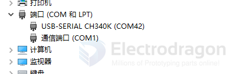

## Usage 

from the perspective of the cable to the perspective of the target

- Green = TXD -> target RXD  
- White = RXD -> target TXD
- Red = VCC -> target +5V
- Black = GND - > target GND

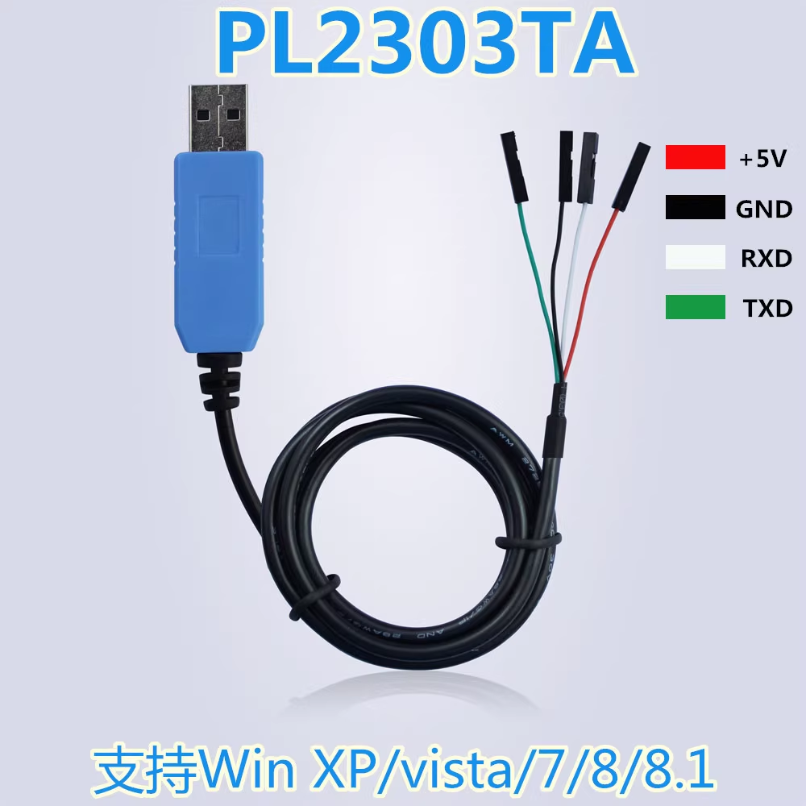

## Product links 

- [[PL2303-dat]]

- [[CH340-dat]] - [[DPR1042-dat]] - [[DPR1039-dat]] - [[WCH-dat]] 

- [[CH343-dat]]

- [[CH9102-dat]] - [[CH9104-dat]]

- [[CP2102-dat]] - [[DPR1003-dat]], [[DPR1005-dat]] == replaceable by [[WCH-dat]] 

- [[CP2104-dat]]

- [[FT232-dat]] - [[DPR1029-dat]] - [[FTDI-dat]]

- 4x channels - [[DPR1120-dat]]

[[DPR1153-dat]]

- [[holtek-dat]] - [[HT42B534-dat]]

### FT232 vs CP2102 

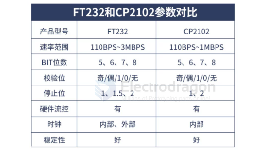

## Use case 

### programming for ESP32 or ESP8266 : 

- TXD -> RXD
- RXD -> TXD
- 5V -> 5V
- GND -> GND. 

Booting Mode select

           Hold down IO0 button, and connect power supply to enter into flash  mode
    do NOT Hold down IO0 button, and connect power supply to enter into normal mode

- please note for [[ESP32-C3-dat]], the programming mode select pin is (button) IO9

### Programming Wiring 

- for [[NWI1126-dat]]

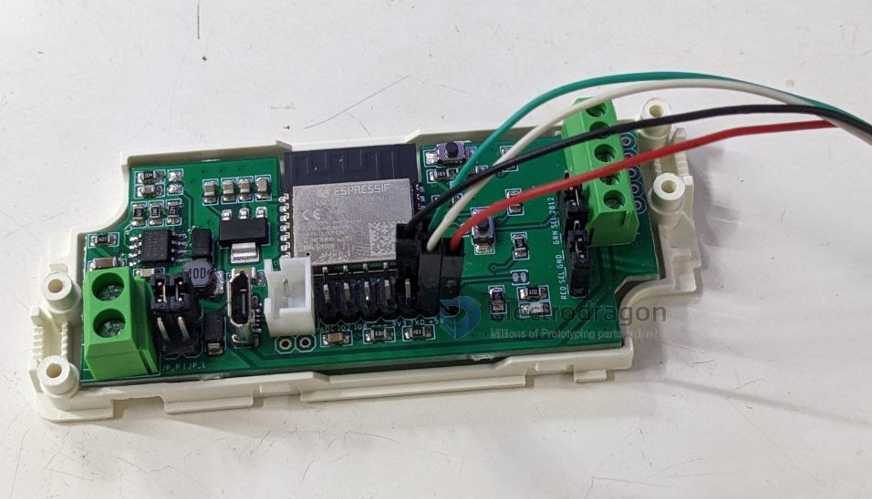

### Confirm selected Mode 

- The COM port monitor used below is [[com-monitor-dat]]
- if your actions are all correct, the module should enter into correct module, and print output as below
- In this mode, you can close the monitor, and further programming it with other SDK like [[arduino-esp32-dat]]

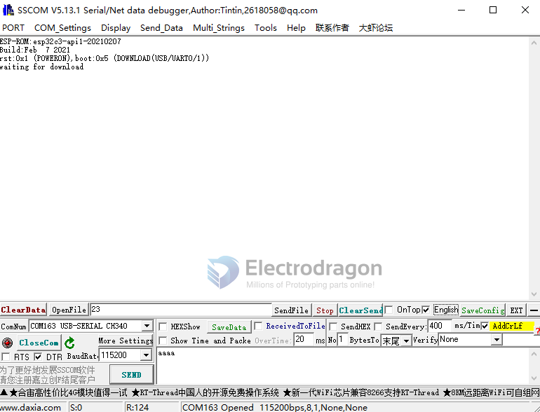

### troubleshooting checklist
- reverse TX RX in case wrong wiring of communication

## Applications 

### Flash target MCU microcontroller
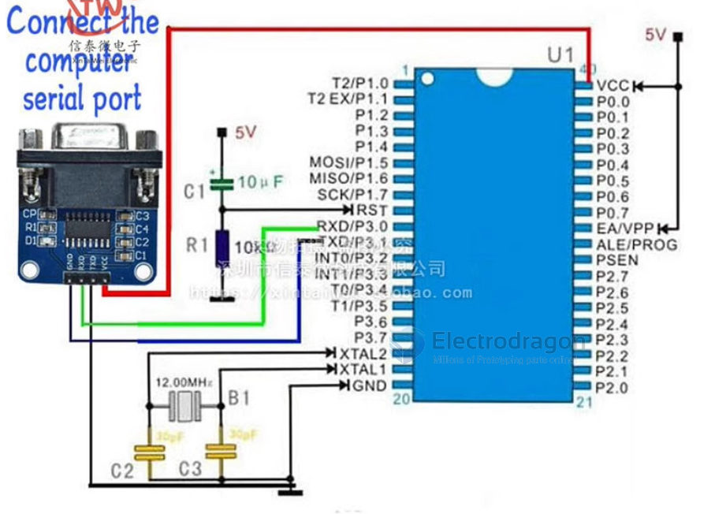

### communicate with GPS module 
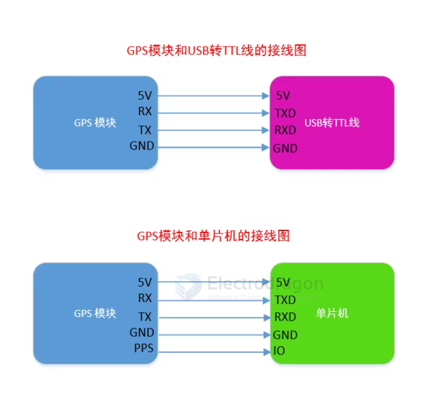

### FTDI FT232RL programming arduino pro mini 

- [[DPR1029-dat]] to [[DAR1010-dat]], [[DAR1007-dat]]
  
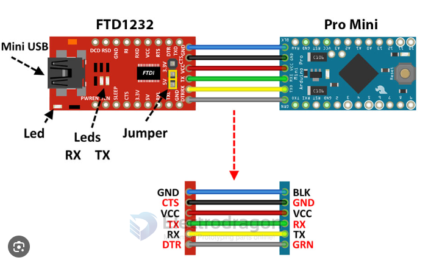

### Programming STM32

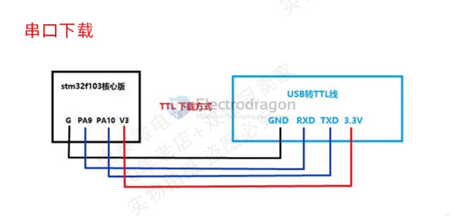

- [[STM32-dat]] - ISP USART
* BOOT0 should be pull to high, foce chip into system memory
* Flash loader demostrator from official ST = Flasher 
* https://www.st.com/en/development-tools/flasher-stm32.html

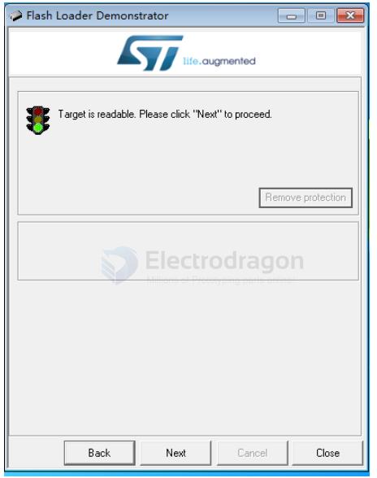
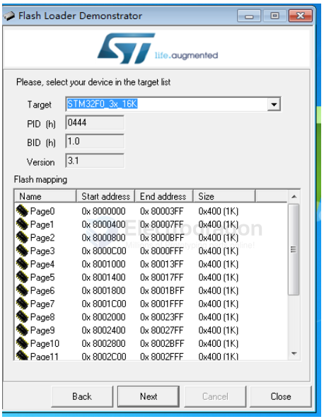
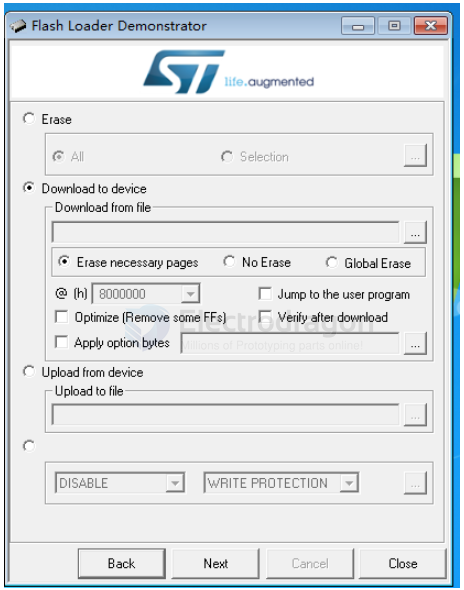

## categorized by target friendly

- [[Arduino-ide-dat]] == [[CH9102-dat]] - [[CH9104-dat]] - [[FT232RL-dat]] - [[CP2102-dat]] - [[CP2104-dat]]

## driver 

- https://github.com/Edragon/COM-Driver
- https://github.com/Edragon/git-Debug
- https://github.com/Edragon/Tools

## APP 

- [[serial-dat]] - [[DTU-dat]]

## demo 

serial flashing with DTR pin for [[arduino-dat]]

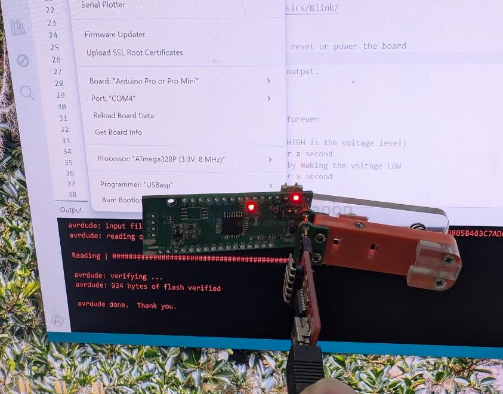

### other interface 

- [[RS485-DAT]] - [[RS232-dat]] - [[I2C-dat]]

- [[usb-ttl]] - [[serial]]

## full interface - Full-Function UART (Universal Asynchronous Receiver-Transmitter)

While modern UART configurations often use just two pins (TXD and RXD) or four pins (adding RTS and CTS), this specific list includes the legacy hardware modem control lines.

---

### Pin Definition & Breakdown

Here is what each specific pin does (note: there is a slight typo in your list; `UART1_R1` is almost certainly `UART1_RI`):

| Pin Name                      | Full Name           | Direction (Relative to DTE/Host) | Description                                                                                        |
| :---------------------------- | :------------------ | :------------------------------- | :------------------------------------------------------------------------------------------------- |
| **UART1_TXD**                 | Transmit Data       | Output                           | Carries the actual serial data being sent out from the host.                                       |
| **UART1_RXD**                 | Receive Data        | Input                            | Carries the incoming serial data being received by the host.                                       |
| **UART1_RTS**                 | Request To Send     | Output                           | Used for hardware flow control. Tells the receiver that the transmitter has data ready to send.    |
| **UART1_CTS**                 | Clear To Send       | Input                            | Used for hardware flow control. Tells the transmitter that the receiver is ready to accept data.   |
| **UART1_DCD**                 | Data Carrier Detect | Input                            | Incoming signal from a modem indicating it has successfully connected to a telephone line/carrier. |
| **UART1_DTR**                 | Data Terminal Ready | Output                           | Outgoing signal from the host indicating it is powered on and ready to communicate.                |
| **UART1_RI** *(listed as R1)* | Ring Indicator      | Input                            | Incoming signal from a modem indicating an incoming phone call/ring is detected.                   |

---

### How It Is Used Today

While originally designed in the 20th century to connect computers (DTE) to telephone modems (DCE), you will still encounter this exact 7-to-8 pin configuration (including Ground) in several modern scenarios:

* **Industrial Automation:** Connecting to legacy PLCs, industrial machinery, and CNC equipment that require full RS-232 signaling.
* **Cellular Modems & IoT Modules:** High-end 4G/5G LTE or NB-IoT modules embedded on PCBs often utilize the full UART interface. The `RI` pin is especially useful for waking up a host microcontroller from deep sleep when an incoming SMS or data packet arrives.
* **Telecommunications:** Network routers and switches still frequently use full serial interfaces for console management.

## SCH 

- [[CH340-dat]] with - [[isolation-dat]]

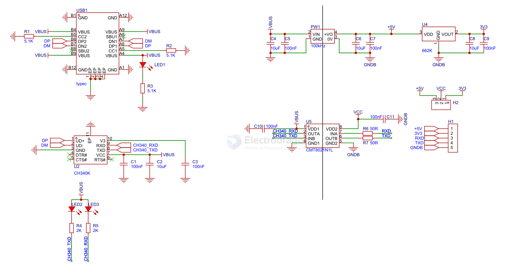

## ref 

software [[com-monitor-dat]]

- [[ESP-SDK-dat]]

