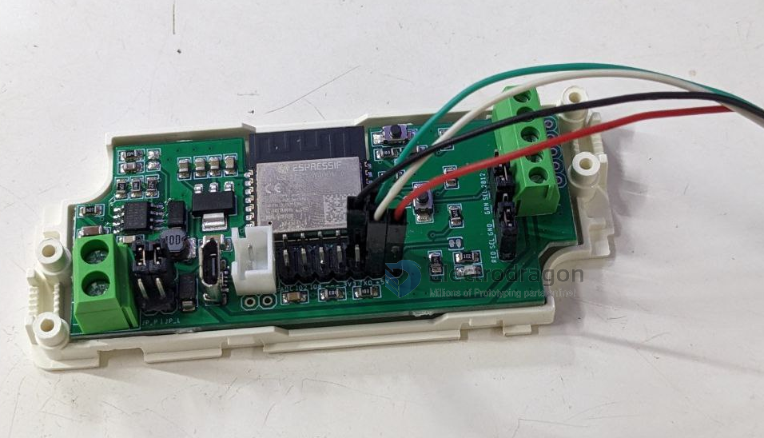
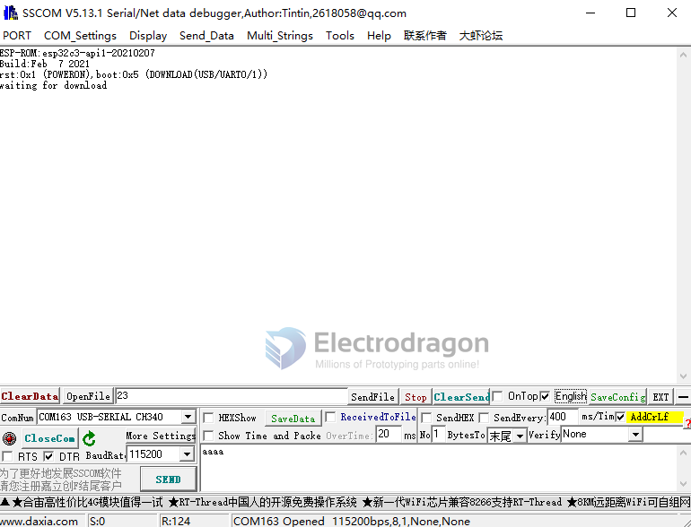
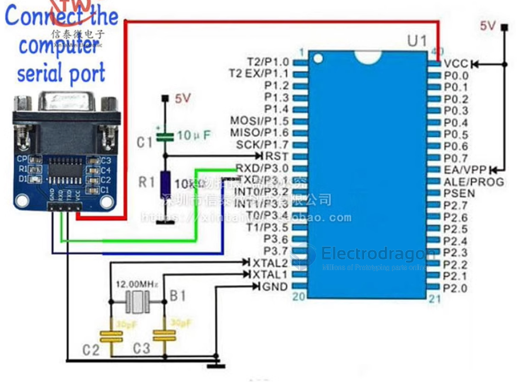
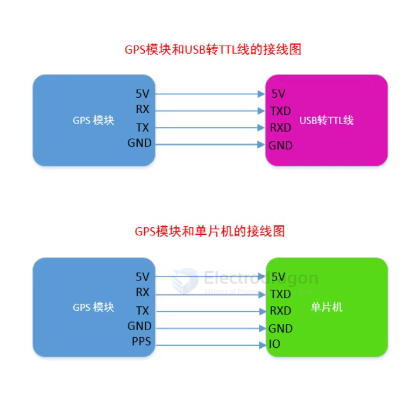
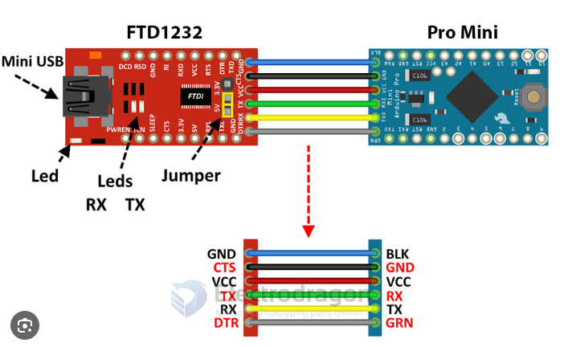
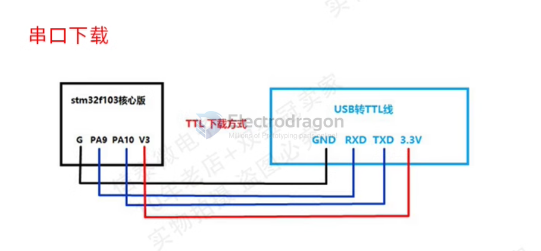
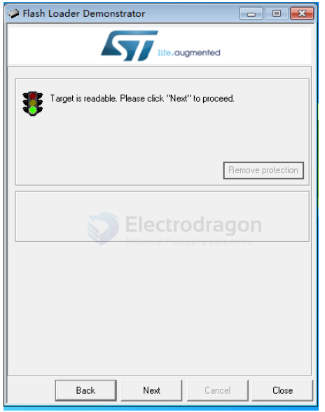
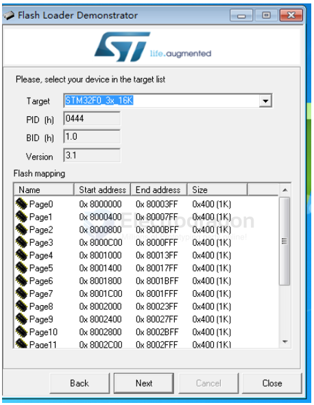
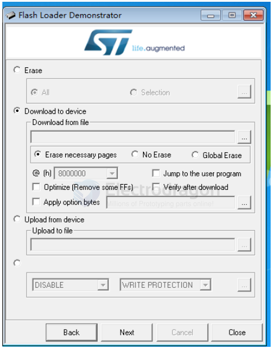

# USB TTL Dat 

- [[serial-monitor-dat]] - [[serial-circuits-dat]]

- [legacy wiki page](https://w.electrodragon.com/w/Serial)

- classic common options - [[CH340-dat]]

- [[USB-sys-dat]] - [[Logic-level-shifter-dat]]

## Usage 

from the perspective of the cable to the perspective of the target

- Green = TXD -> target RXD  
- White = RXD -> target TXD
- Red = VCC -> target +5V
- Black = GND - > target GND

## Product links 

- [[PL2303-dat]]

- [[CH340-dat]] - [[DPR1042-dat]] - [[DPR1039-dat]] - [[WCH-dat]] 

- [[CH343-dat]]

- [[CH9102-dat]] - [[CH9104-dat]]

- [[CP2102-dat]] - [[DPR1003-dat]], [[DPR1005-dat]] == replaceable by [[WCH-dat]] 

- [[CP2104-dat]]

- [[FT232-dat]] - [[DPR1029-dat]] - [[FTDI-dat]]

- 4x channels - [[DPR1120-dat]]

[[DPR1153-dat]]

## Use case 

### programming for ESP32 or ESP8266 : 

- TXD -> RXD
- RXD -> TXD
- 5V -> 5V
- GND -> GND. 

Booting Mode select

           Hold down IO0 button, and connect power supply to enter into flash  mode
    do NOT Hold down IO0 button, and connect power supply to enter into normal mode

- please note for [[ESP32-C3-dat]], the programming mode select pin is (button) IO9

### Programming Wiring 

- for [[NWI1126-dat]]

### Confirm selected Mode 

- The COM port monitor used below is [[com-monitor-dat]]
- if your actions are all correct, the module should enter into correct module, and print output as below
- In this mode, you can close the monitor, and further programming it with other SDK like [[arduino-esp32-dat]]

### troubleshooting checklist
- reverse TX RX in case wrong wiring of communication

## Applications 

### Flash target MCU microcontroller

### communicate with GPS module 

### FTDI FT232RL programming arduino pro mini 

- [[DPR1029-dat]] to [[DAR1010-dat]], [[DAR1007-dat]]
  

### Programming STM32

- [[STM32-dat]] - ISP USART
* BOOT0 should be pull to high, foce chip into system memory
* Flash loader demostrator from official ST = Flasher 
* https://www.st.com/en/development-tools/flasher-stm32.html

## categorized by target friendly

- [[Arduino-ide-dat]] == [[CH9102-dat]] - [[CH9104-dat]] - [[FT232RL-dat]] - [[CP2102-dat]] - [[CP2104-dat]]

## ref 
software [[com-monitor-dat]]

- [[ESP-SDK-dat]]

### other interface 
- [[RS485-DAT]] - [[RS232-dat]] - [[I2C-dat]]

- [[usb-ttl]] - [[serial]]