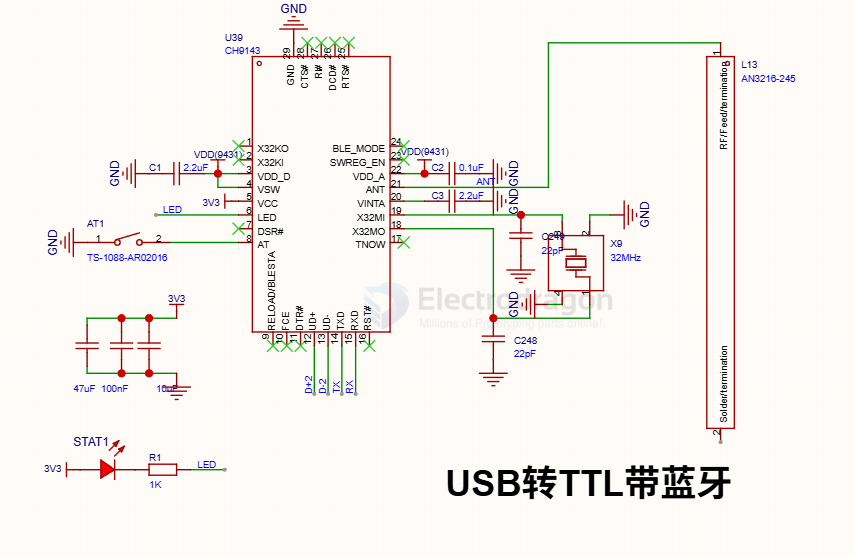
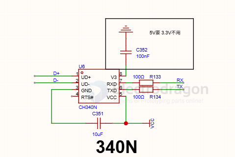
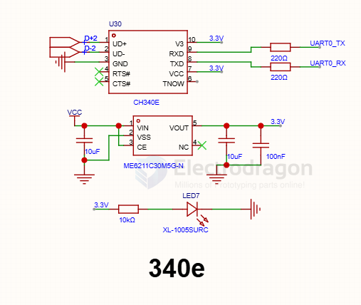

# serial-HDK-dat

- [[serial-HDK-dat]] 

- [[auto-serial-dat]]

- [[logic-level-shifter-dat]]

## Circuits 

- [[auto-serial-dat]]

common PCB setup 
- one row: GND / RXD / TXD / VCC
- two row -1: GND / VCC
- two row -2: RXD / TXD

## MCU design 

- [[serial-dat]] - [[STC-dat]] - [[logic-level-shifter-dat]]

## build 

- [[CH9143-dat]] - [[CH340-dat]] N/E

## ref 

- [[serial-dat]]