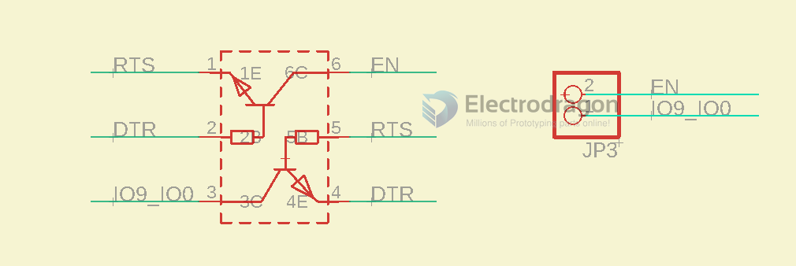
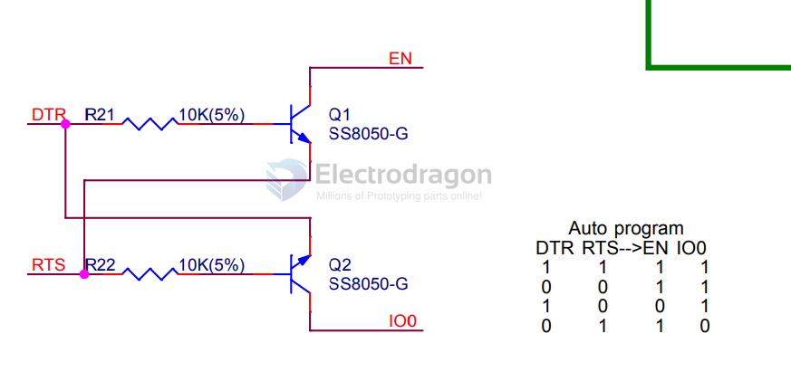
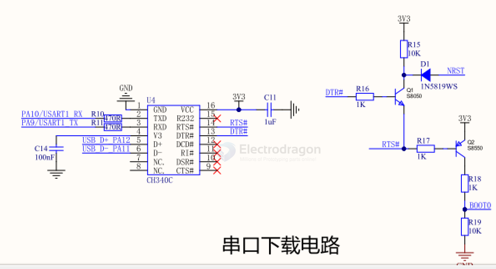

# auto-serial-dat

by 2x SS8050

- [[dual-mosfet-dat]]

when RTS enable, DTR == IO0, when DTR enable, RTS == EN 

| DTR | RTS | EN  | IO0 |
| --- | --- | --- | --- |
| 1   | 1   | 1   | 1   |
| 0   | 0   | 1   | 1   |
| 1   | 0   | 0   | 1   |
| 0   | 1   | 1   | 0   |

| Gate G1 | Source S1 | Drain D1 | Gate G2 | Source S2 | Drain D2 |
| ------- | --------- | -------- | ------- | --------- | -------- |
| DTR     | RTS       | EN       | RTS     | DTR       | IO0      |
| 1       | 1         | 1        | 1       | 1         | 1        |
| 0       | 0         | 1        | 0       | 0         | 1        |
| 0       | 1         | 1        | 1       | 0         | 0        |
| 1       | 0         | 0        | 0       | 1         | 1        |

## auto serial for [[STM32-HDK-dat]] 

| DTR | Q1  | NRST | RTS | Q2  | BOOT0 |
| --- | --- | ---- | --- | --- | ----- |
| 0   | OFF | 1    | 0   | ON  | 1     |
| 0   | OFF | 1    | 1   | OFF | 0     |
| 1   | ON  | 0    | 0   | ON  | 1     |
| 1   | ON  | 1    | 1   | OFF | 0     |

- [[S8050-dat]] - [[transistor-dat]]

## ref 

- [[serial-dat]]