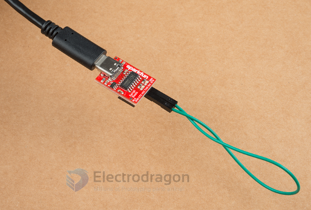

# serial-loop-test-dat.md

You can also verify if the USB-to-serial converter is working by doing a serial loop back test or echo test. If you are using the breakout board, you can add a jumper between the Tx and Rx to try and echo a character in a terminal program. For more information, try checking out the Hardware Test for the serial basic hookup guide.

Test with loop windows: [[SSCOM-dat]]

## ref 

- [[SSCOM-dat]]