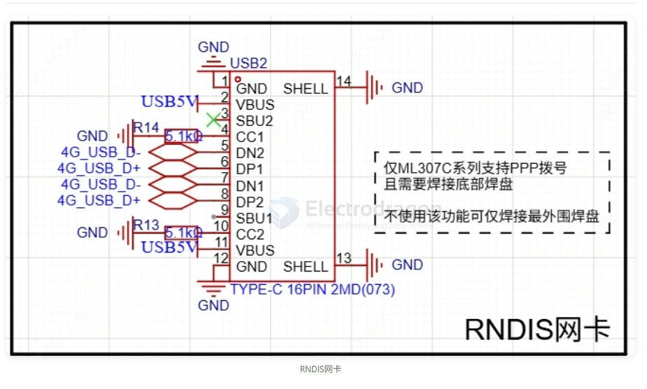

# RNDIS-dat

- [[RNDIS-dat]] - [[USB-SDK-dat]] - [[network-dat]]

- [[chinamobile-dat]] - [[ML307C-dat]] - [[M2M-dat]] - [[LTE-dat]]

ML307C系列模组支持PPP拨号通讯协议，可通过USB走RNDIS实现4G网卡上网功能，通过接入TYPEC后主机设备会识别成有线网卡，如未识别需手动在设备管理器切换驱动。需要注意的是使用此功能则必须焊接模组底部USB信号线焊盘，建议使用加热台或风枪。

## ref 

