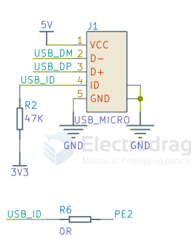
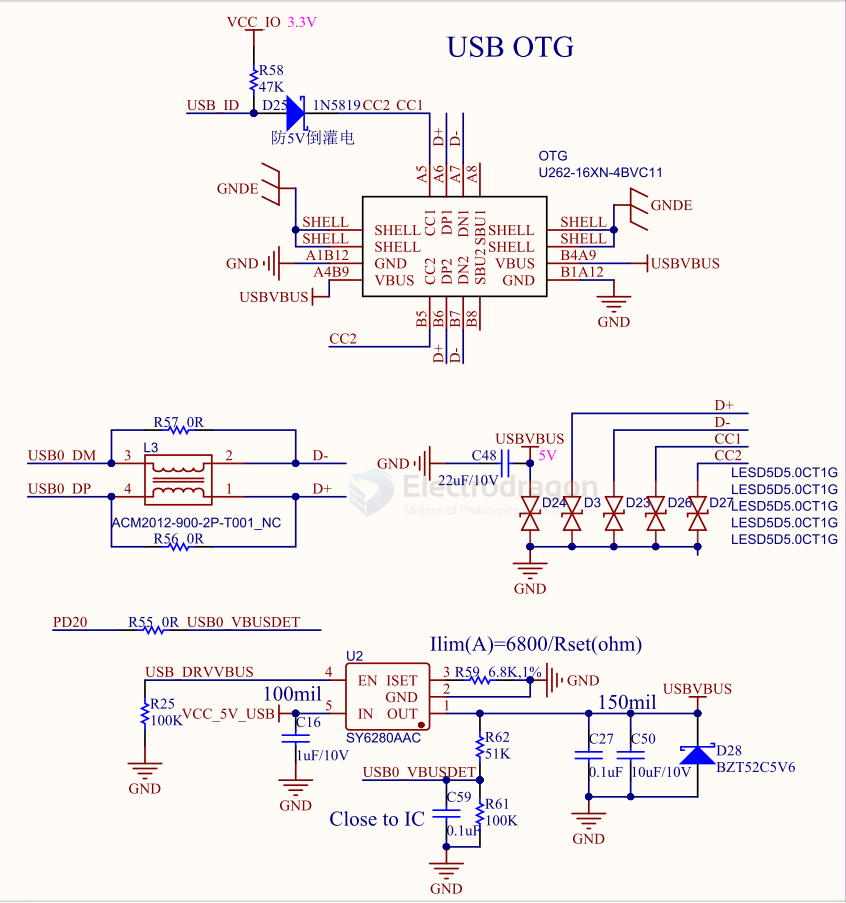
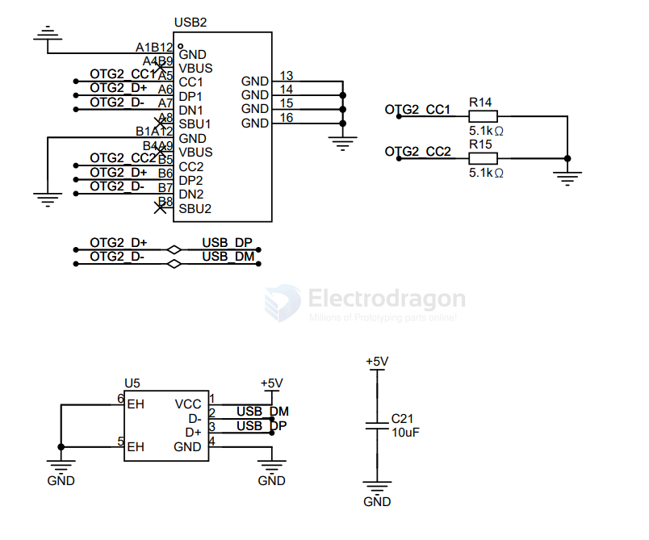
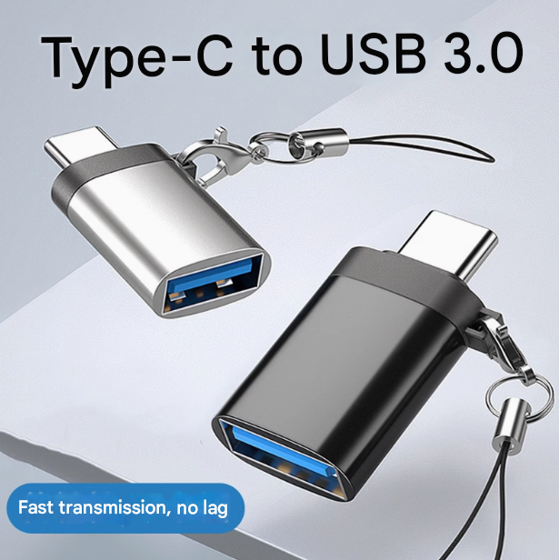

# USB-OTG-dat

- [[ESP32-S3-dat]]

- [[ESP32-C3-USB-dat/ESP32-USB-dat]] - [[ESP32-USB-dat]]

- [[STM32-USB-dat]]

## SCH 1 

- [[F1C100-HDK-dat]]

SCH 2 

- [[SY6280-dat]]

## USB OTG/USB TYPE-C

USB-C OTG (On-The-Go) Hardware Requirements

To enable OTG support on a USB-C DIY project, you must signal to the Host (the phone) that it should act as a Master and provide 5V power.

**The Wiring:**
* **Data:** Connect D+ and D- pins.
* **Power:** Connect VBUS and GND.
* **OTG Signal:** Place a **5.1kΩ resistor** between the **CC pin** and **GND**.

**How it works:**
1. The phone detects the **5.1kΩ Pull-down (Rd)** on the CC line.
2. The phone's internal controller switches from **Sink** (receiving power) to **Source** (providing power).
3. The phone outputs **5V** on the VBUS line to power your mouse, keyboard, or MIDI device.

该部分连接到了芯片的DP/DM引脚，为芯片的USB接口。

USB Type-C用于USB Fel模式烧录系统，无供电输入/输出能力。

USB OTG处可用于连接其他USB设备，带5V输出，可用于连接其他USB设备，当然也可以接双头USB Type-A线缆用于USB Fel模式。

该模块原理图如下所示：

需要注意的是，开发板中没有连接ID线（ID线用于识别USB模式），所以在编写设备树时，我们需要强制指定USB模式为主机或从机。

## cell phone type-c gadget 

