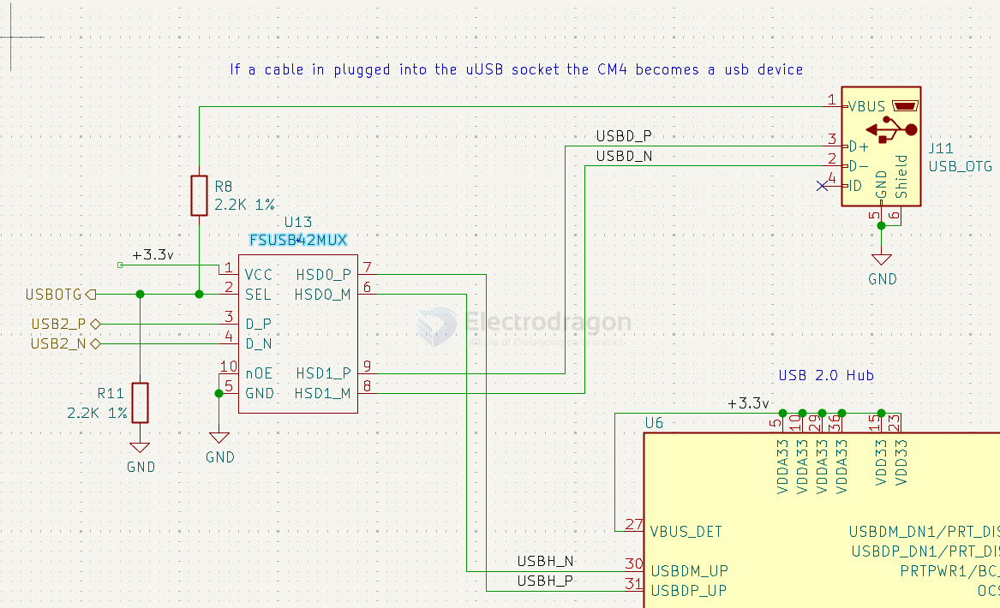

# USB-Switch-dat

Low-Power, Two-Port, High-Speed, USB2.0 (480Mbps) UART Switch

- USBD0 - usb_hub
- USBB - typc_c

## FSUSB42

Low-Power, Two-Port, High-Speed, USB2.0 (480Mbps) UART Switch

- [[RPI-CM4-expansion-board-dat]]

## ref 

- [[USB-dat]]