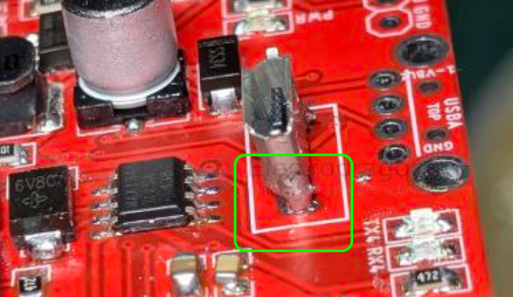

# CONN-USB-micro-vertical-dat

This connector needs to be soldered on both side to ensure good connection to prevent plug in and out foce. 

this vertical micro usb is easily to loose (10~20% chance) if only back side soldered

add more soldering on the sides to reinforce the connection from the front side too. 

influenced products: [[NWI1119-dat]] - [[NWI1126-dat]] - [[NWI1252-dat]] - [[NWI1254-dat]] == [[ESP32-C3-dat]]

log in [[QC-dat]]

## ref 

- [[CONN-USB-micro-dat]]