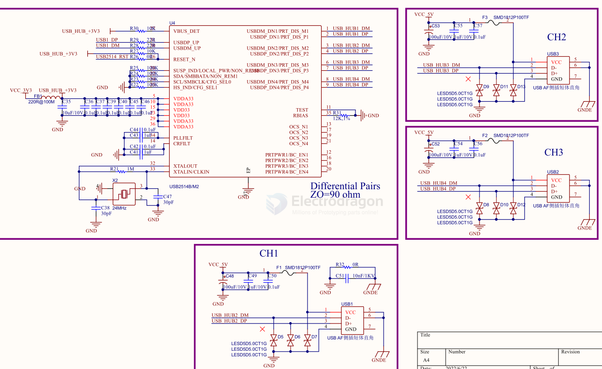

# USB-Hub-dat

## FE1.1 

## GL850

- [[GL850-dat]]

## USB2514

[USB2514 - USB251xB/USB251xBi USB 2.0 Hi-Speed Hub Controller Data Sheet](https://ww1.microchip.com/downloads/aemDocuments/documents/OTH/ProductDocuments/DataSheets/00001692C.pdf)

The Microchip USB251xB/xBi hub is a family of lowpower, configurable, MTT (multi transaction translator) hub controller IC products for embedded USB solutions. 

The x in the part number indicates the number of downstream ports available, while the B indicates battery charging support. 

The Microchip hub supports lowspeed, full-speed, and hi-speed (if operating as a hispeed hub) downstream devices on all of the enabled downstream ports.

SCH 

## CH334 

项目采用CH334F将一路usb信号拓展至四路，其中ESP32S3、RP2040和CH549G各连接一路，另外的一路由一个usbA口引出，可以外接usb设备同时为开发板或者手机供电。

## ref 

- [[USB-dat]]