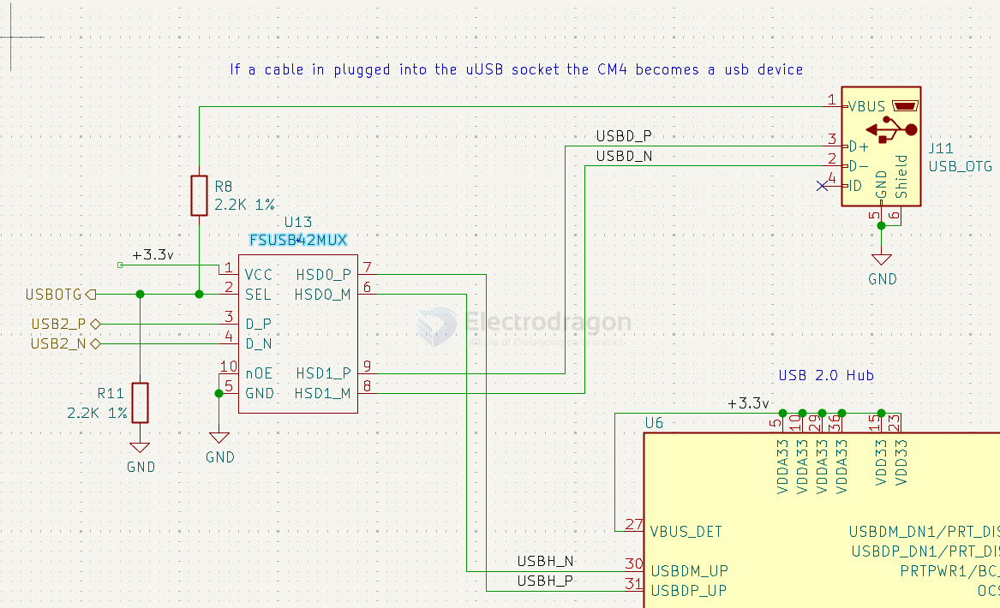
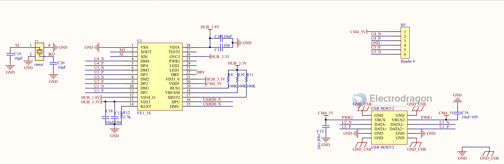
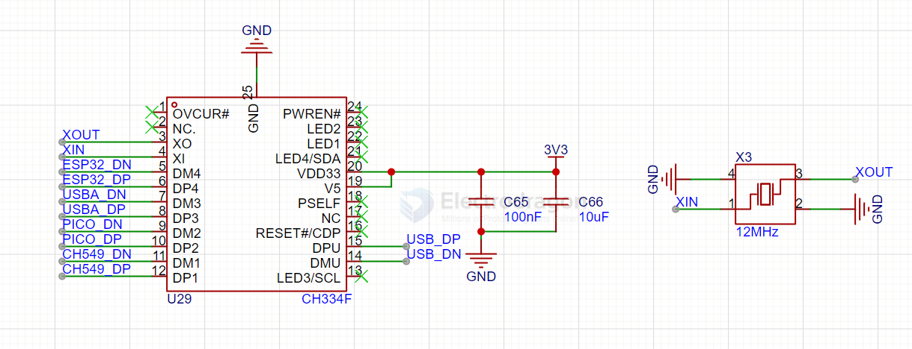

# USB-Hub-dat

- [[microchip-dat]]

## FSUSB42

Low-Power, Two-Port, High-Speed, USB2.0 (480Mbps) UART Switch

- [[RPI-CM4-expansion-board]]

## FE1.1 

## GL850

- [[GL850-dat]]

## CH334 

项目采用CH334F将一路usb信号拓展至四路，其中ESP32S3、RP2040和CH549G各连接一路，另外的一路由一个usbA口引出，可以外接usb设备同时为开发板或者手机供电。

## ref 

- [[USB-dat]]