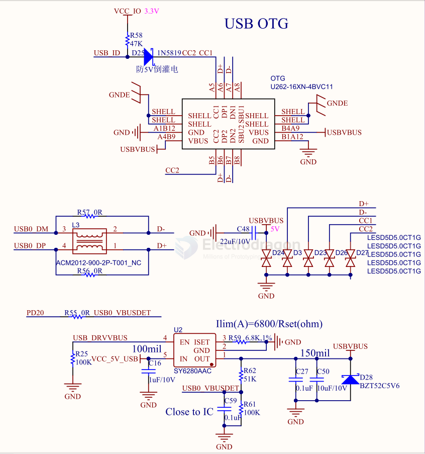
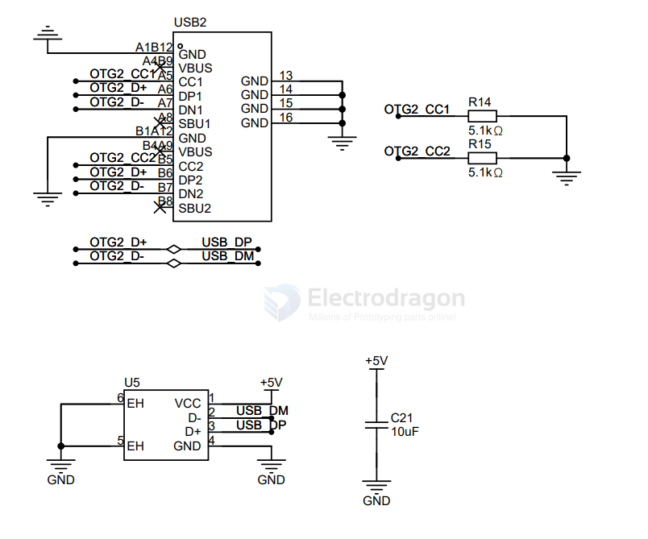

# USB-OTG-dat

- [[ESP32-S3-dat]]

- [[ESP32-C3-usb-dat]] - [[ESP32-USB-dat]]

- [[STM32-USB-dat]]

## SCH 1 

- [[F1C100-HDK-dat]]

SCH 2 

- [[SY6280-dat]]

## USB OTG/USB TYPE-C

该部分连接到了芯片的DP/DM引脚，为芯片的USB接口。

USB Type-C用于USB Fel模式烧录系统，无供电输入/输出能力。

USB OTG处可用于连接其他USB设备，带5V输出，可用于连接其他USB设备，当然也可以接双头USB Type-A线缆用于USB Fel模式。

该模块原理图如下所示：

需要注意的是，开发板中没有连接ID线（ID线用于识别USB模式），所以在编写设备树时，我们需要强制指定USB模式为主机或从机。

## cell phone type-c gadget 

