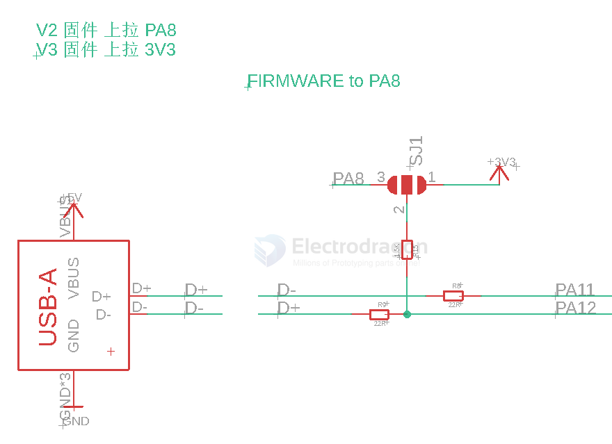
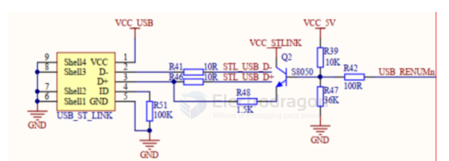

# USB-STM32-dat

## STM32 USB 

### DFU USB OTG 

[[File:stm32-DFU.gif]]

* Listed supported device in ST documents [https://www.st.com/content/ccc/resource/technical/document/application_note/6a/17/92/02/58/98/45/0c/CD00264379.pdf/files/CD00264379.pdf/jcr:content/translations/en.CD00264379.pdf AN3156] 

* Download [http://www.st.com/en/development-tools/stsw-stm32080.html DfuSe USB device firmware upgrade (DFU) software]
* Install the drive in installation folder -C:\Program Files (x86)\STMicroelectronics\Software\DfuSe v3.0.5\Bin\Driver or here [[STM-Bootloader-Driver.zip]] STM32 Bootloader Driver
* Testing firmware for [[File:Can-usb.zip]] USB-CAN here.
* Open the DFU tool to upload firmware to internal flash, see left animation.

### USB DFU

* Short connect Boot0 + 3V3 to re-enter into USB DFU mode
* use STM32CubeProgrammer upload hex or DFU file.
In other boot try:
* In case of SLCAN software connect UCCB and type in terminal '''boot''' device should reset and new device should connect to Your pc

## CMSIS-DAP USB 

## ST-LINK USB part 

## ref 

- [[STM32-dat]] - [[USB-dat]]

- [[CMSIS-DAP-dat]] - [[MDK-ARM-dat]] - [[DAPLINK-dat]]