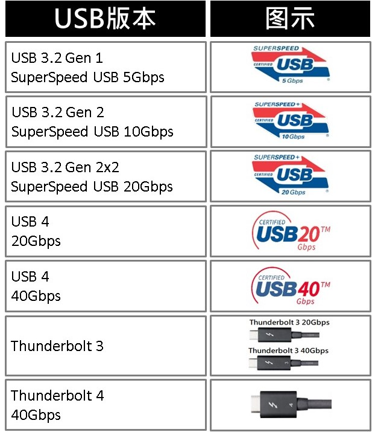
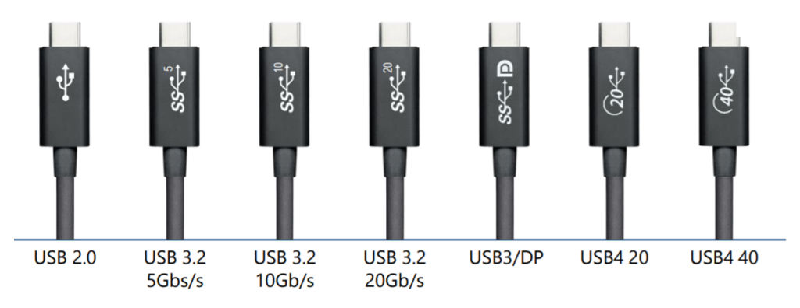
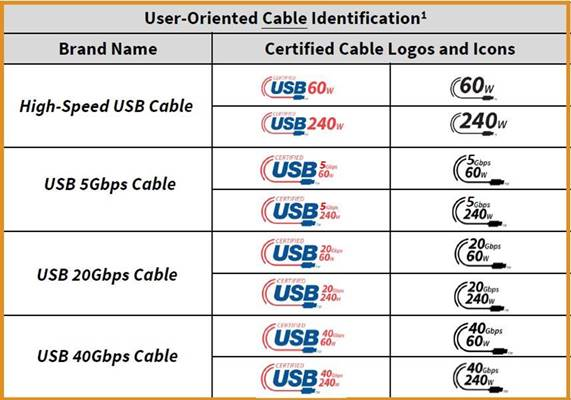
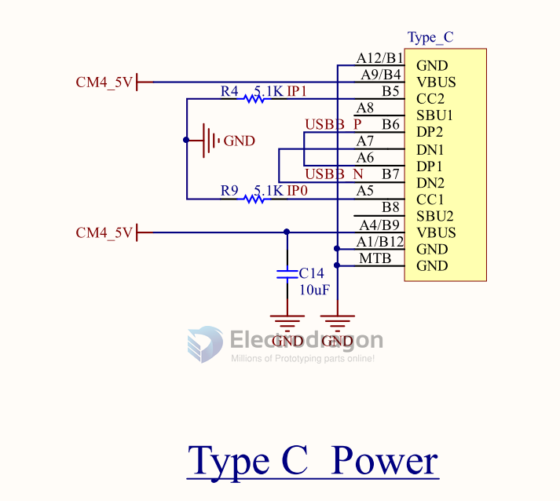

# typec-dat

- [[type-c-hdk-dat]]

- [[peripherals-dat]]

## history 

USB Type-C encompasses many protocols such as USB 3, USB4, Thunderbolt 3, Thunderbolt 4, etc. Different product applications correspond to different USB version speeds, as shown in the table below:

Although they all use the USB Type-C interface, due to differences in protocol versions and speeds, achieving optimal performance requires consistency in matching the system/device/USB Type-C cable. Different devices or systems also require different cables. Just considering speed, USB Type-C cables have the following distinctions:

As transmission speeds increase, the power demand for high-speed devices also grows larger. Therefore, USB Type-C must introduce various specifications to cope. The USB PD Revision 3.1 specification released by USB-IF in 2021 proposed EPR (Extended Power Range) power supply, requiring a maximum of 240W to meet the demand for high power supply. In summary, the numerous classifications of cable specifications and version speeds are almost dazzling, inevitably causing confusion for consumers when making purchases.

To improve this situation, in March 2022, USB-IF proposed certification combining cable transmission speed and supported power capability, and redefined cable specifications. In the future, cables will no longer be differentiated by version, but rather by "universal speed and power supply."

## type-c pin definitions

The USB Type-C connector has 24 pins. Here is the pinout for the receptacle:

**Top Row:**
| Pin | Name   | Description                                     |
| --- | ------ | ----------------------------------------------- |
| A1  | GND    | Ground                                          |
| A2  | SSTXp1 | SuperSpeed Differential Pair #1, TX, Positive   |
| A3  | SSTXn1 | SuperSpeed Differential Pair #1, TX, Negative   |
| A4  | VBUS   | Bus Power                                       |
| A5  | CC1    | Configuration Channel                           |
| A6  | Dp1    | USB 2.0 Differential Pair, Position 1, Positive |
| A7  | Dn1    | USB 2.0 Differential Pair, Position 1, Negative |
| A8  | SBU1   | Sideband Use (SBU)                              |
| A9  | VBUS   | Bus Power                                       |
| A10 | SSRXn2 | SuperSpeed Differential Pair #2, RX, Negative   |
| A11 | SSRXp2 | SuperSpeed Differential Pair #2, RX, Positive   |
| A12 | GND    | Ground                                          |

**Bottom Row:**
| Pin | Name   | Description                                     |
| --- | ------ | ----------------------------------------------- |
| B12 | GND    | Ground                                          |
| B11 | SSRXp1 | SuperSpeed Differential Pair #1, RX, Positive   |
| B10 | SSRXn1 | SuperSpeed Differential Pair #1, RX, Negative   |
| B9  | VBUS   | Bus Power                                       |
| B8  | SBU2   | Sideband Use (SBU)                              |
| B7  | Dn2    | USB 2.0 Differential Pair, Position 2, Negative |
| B6  | Dp2    | USB 2.0 Differential Pair, Position 2, Positive |
| B5  | CC2    | Configuration Channel                           |
| B4  | VBUS   | Bus Power                                       |
| B3  | SSTXn2 | SuperSpeed Differential Pair #2, TX, Negative   |
| B2  | SSTXp2 | SuperSpeed Differential Pair #2, TX, Positive   |
| B1  | GND    | Ground                                          |

**Key Points:**
*   **Symmetry:** The pinout is symmetrical, allowing the plug to be inserted either way up.
*   **USB 2.0:** Only one set of D+/D- pins (either A6/A7 or B6/B7) is connected through the cable at any time.
*   **SuperSpeed:** TX/RX pairs are used for high-speed data (USB 3.x, DisplayPort Alt Mode, Thunderbolt, etc.).
*   **CC Pins:** Used for detecting connection, orientation, role (Host/Device/DRP), and managing Power Delivery (PD).
*   **SBU Pins:** Used for Alternate Modes, such as DisplayPort or Audio Adapter Accessory Mode.
*   **VBUS/GND:** Provide power and ground reference. Multiple pins are used to handle higher currents for Power Delivery.

- [[DisplayPort-dat]] - [[Thunderbolt-dat]]

## Conversion to USB 2.0 

- [[USB-2.0-dat]] - [[USB-3.0-dat]] - [[USB-4.0-dat]]

- VBUS: Connect one or more Type-C VBUS pins (A4, A9, B4, B9) to the USB-A VBUS pin (Pin 1).
- GND: Connect one or more Type-C GND pins (A1, A12, B1, B12) to the USB-A GND pin (Pin 4).
- D+: Connect one of the Type-C D+ pins (A6 or B6) to the USB-A D+ pin (Pin 3).
- D-: Connect the corresponding Type-C D- pin (A7 or B7) to the USB-A D- pin (Pin 2).
- CC Pin: This is crucial for Type-C. For a simple adapter presenting a USB-A port, one of the CC pins (A5 or B5) on the Type-C plug needs a 5.1 kΩ pull-down resistor (Rd) connected to GND. This signals to the connected Type-C device that it's attached to a legacy USB downstream-facing port (like the one provided by the adapter).

Note:

- This only covers USB 2.0 functionality. Converting for USB 3.x SuperSpeed requires connecting the SSTX and SSRX pairs as well, which is more complex.
- Features like Power Delivery (PD) beyond basic 5V and Alternate Modes (like DisplayPort) are not supported through this simple conversion.
- Commercial adapters and cables handle this internal wiring. Building such an adapter requires careful attention to the USB specifications, especially regarding the CC pin configuration.

## wiring to CM4 

## ref 

- [[usb]] - [[type-c]] - [[type-c-cable]]