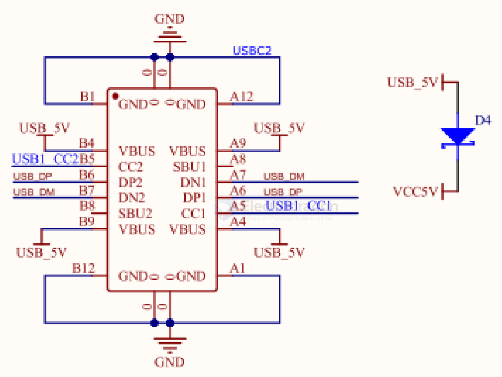

# usb-dat 

- [[USB-driver-dat]] - [[libusb-dat]]

- [[USB-cable-dat]] - [[USB-ESD-dat]] 

- [[CONN-USB-dat]] - [[conn-dat]]

- [[USB-STM32-dat]]

- [[USB-OTG-dat]] - [[USB-CDC-dat]] - [[USB-HID-dat]] - [[USB-MSC-dat]] - [[USB-DFU-dat]] - [[WebSerial-dat]]

- [[USB-MTP-dat]]

- [[keyboard-dat]] - [[mouse-dat]]

- [[USB-FC-trigger-dat]] - [[USB-FC-dat]]

- [[WCH-dat]]

- [[IP5306-dat]]

- [[USB-Hub-dat]] - [[USB-Switch-dat]]

## USB variations 

- [[USB-2.0-dat]] - [[usb-type-c-dat]]

- [[lightning-dat]]

## signal conversion 

- [[USB-SPI-dat]]

## Devices 

- [[ARM1003-dat]] - [[MOT1022-dat]]

## Schematic

### USB with STM32 

## USB w/ [[CH579-dat]]

### USB with a diode 

## Terms 

### USB standard 

- USB 2.0 is a widely used standard for connecting devices to computers and other peripherals. It supports data transfer rates of up to 480 Mbps and is backward compatible with USB 1.1.
- USB 3.0 is a newer standard that offers significantly faster data transfer rates of up to 5 Gbps and improved power management features. It is backward compatible with USB 2.0.
- USB 3.1 is an even newer standard that provides data transfer rates of up to 10 Gbps and introduces new features like USB Type-C connectors, which are reversible and support higher power delivery.
- USB 3.2 is the latest standard that can achieve data transfer rates of up to 20 Gbps by using multiple lanes for data transmission. It also supports USB Type-C connectors and improved power delivery capabilities.
- USB 4.0 is the latest standard that combines the features of USB 3.2 and Thunderbolt 3, offering data transfer rates of up to 40 Gbps and improved compatibility with Thunderbolt devices.

### USB others 

- USB-C is a new connector type that is reversible and can support various protocols, including USB 3.1, Thunderbolt 3, and DisplayPort. It is becoming the standard connector for many devices, including smartphones, laptops, and peripherals.
- USB Power Delivery (PD) is a specification that allows devices to negotiate power requirements and deliver higher power levels over USB connections. It enables faster charging and power delivery to devices like laptops and smartphones.
- USB Audio is a specification that allows audio devices to connect to computers and other peripherals using USB connections. It supports high-quality audio streaming and can replace traditional audio connectors like 3.5mm jacks.
- USB HID (Human Interface Device) is a class of USB devices that includes keyboards, mice, and game controllers. It allows these devices to communicate with computers without the need for custom drivers.

- USB Mass Storage is a class of USB devices that allows storage devices like flash drives and external hard drives to connect to computers and other peripherals. It enables easy file transfer and access to storage media.
- USB Serial is a class of USB devices that allows serial communication over USB connections. It is commonly used for connecting microcontrollers and other embedded systems to computers for debugging and data transfer.
- USB CDC (Communications Device Class) is a class of USB devices that allows devices to emulate serial ports over USB connections. It is commonly used for connecting modems, network adapters, and other communication devices to computers.
- USB MTP (Media Transfer Protocol) is a protocol that allows devices to transfer media files like photos and videos over USB connections. It is commonly used for connecting smartphones and cameras to computers for file transfer.
- USB PTP (Picture Transfer Protocol) is a protocol that allows devices to transfer images and videos over USB connections. It is commonly used for connecting digital cameras to computers for file transfer.

### USB OTG 

- USB OTG (On-The-Go) is a specification that allows USB devices to act as hosts, enabling them to connect directly to other USB devices without the need for a PC. This is particularly useful for mobile devices and embedded systems.
- USB OTG ID is a pin used in USB OTG connections to determine the role of the device (host or peripheral). It helps devices negotiate their roles in the connection.
- USB OTG cable is a special cable that allows devices to connect in USB OTG mode. It typically has a micro USB connector on one end and a standard USB connector on the other end.
- USB OTG adapter is a device that allows devices to connect in USB OTG mode. It typically has a micro USB connector on one end and a standard USB connector on the other end.
- USB OTG host mode is a mode in which a device acts as a host in a USB OTG connection. This allows it to connect to other USB devices and control them.
- USB OTG peripheral mode is a mode in which a device acts as a peripheral in a USB OTG connection. This allows it to connect to a host device and be controlled by it.
- USB OTG power is the power supplied to a device in a USB OTG connection. It can be negotiated between the host and peripheral devices to ensure proper operation.
- USB OTG power supply is the power source used to power devices in a USB OTG connection. It can be provided by the host device or an external power source.
- USB OTG power management is the process of managing power consumption in USB OTG connections. It involves negotiating power requirements and optimizing power usage to extend battery life.
- USB OTG power delivery is a feature that allows devices to negotiate power requirements and deliver higher power levels over USB connections. It enables faster charging and power delivery to devices like laptops and smartphones.
- USB OTG power bank is a portable power source that can be used to power devices in a USB OTG connection. It typically has a USB connector for charging and can provide power to multiple devices simultaneously.
- USB OTG power switch is a device that allows users to control the power supply to devices in a USB OTG connection. It can be used to turn devices on or off and manage power consumption.
- USB OTG power cable is a special cable that allows devices to connect in USB OTG mode and provides power to the connected devices. It typically has a micro USB connector on one end and a standard USB connector on the other end.
  

## Converter 

MicroA_2_A_Female

## USB mode 

- USB CDC / Serial
- USB JTAG 

## functions 

## 📌 What Is **MHL**?
**MHL (Mobile High-Definition Link)** is an older technology that allows a phone’s **micro-USB port** to output video to a TV via **HDMI**.

### Key Features
- Uses **micro-USB → HDMI** adapters
- Requires **hardware support** inside the phone
- Needs **external power** (adapter has a power input)
- Supported mostly from **2012–2016**
- Max output usually **1080p**, later versions support 4K

### Commonly Supported On
- Older Samsung Galaxy phones  
- Sony Xperia  
- HTC and LG phones  

### Not Supported On
- **Any Google Pixel model**  
- Most modern USB-C phones

---

## 📌 What Is **SlimPort**?
**SlimPort** is another wired video output standard, similar to MHL but more flexible.

### Key Features
- Converts phone’s USB into:
  - **HDMI**
  - **DisplayPort**
  - **VGA**
  - **DVI**
- Often **no external power** needed
- Supported roughly from **2013–2017**
- Max output up to **4K @ 30Hz**

### Commonly Supported On
- Nexus 4  
- Nexus 5  
- Nexus 7 (2013)  
- LG G2 / G3  
- Some tablets & Chromebooks  

## ref 

- [[USB-A-dat]]
  
- [[USB]]