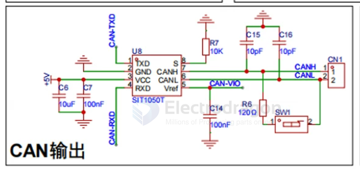
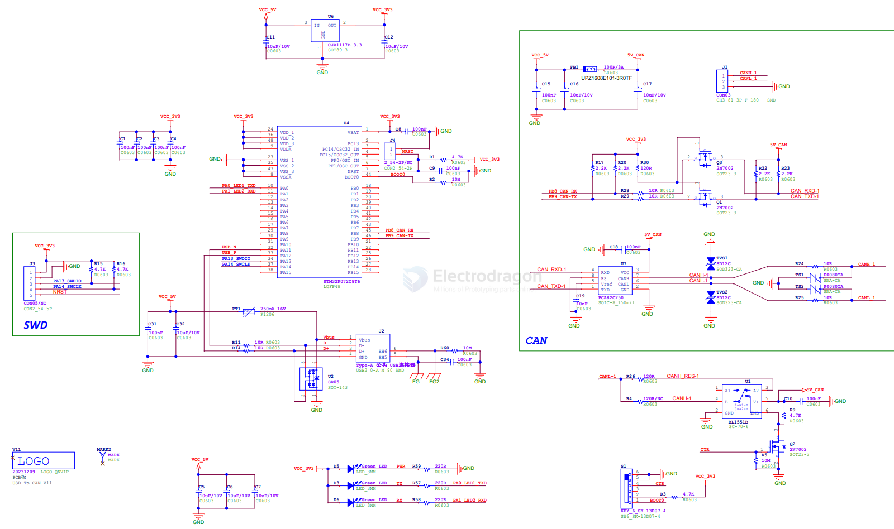
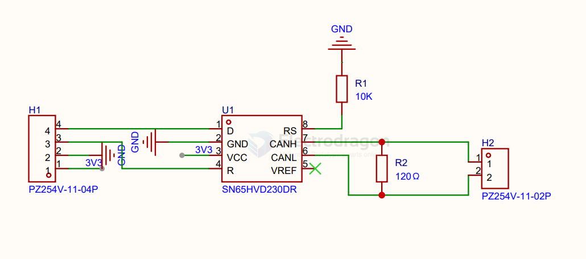

# Can-dat 

- [[protection-ESD-dat]] - [[protection-power-dat]] - [[CAN-dat]] - [[LDO-dat]]

- [[CAN-Cangaroo-dat]] - [[CAN-FD-dat]]

- [[conn-cable-terminal-dat]] -[[CONN-dat]] 

legacy wiki page - https://w.electrodragon.com/w/Category:CAN

- [[CAN-dat]] - [[K-line-dat]] - [[OBD-dat]]

- [[ECU-dat]]

## Chip 

SIT1050 - 5V，±40V BUS，1Mbps High Speed CAN transceiver

- [[protection-power-dat]]

- TI ISO1050DUBR

CAN Transceiver - [[NXP-CAN-dat]] 

- ADM3052 

SPI to CAN - [[MCP2551-dat]]

[[TJA1050-dat]] - [[TJA1021-dat]] 

## board 

- [[ITF1000-dat]]

- [[STC-dat]]

## common software 

| firmware               | note  | builder    | link                                                   |
| ---------------------- | ----- | ---------- | ------------------------------------------------------ |
| slCAN (SocketCAN)      | linux | canable.io | https://github.com/normaldotcom/canable-fw             |
| candleLight            |       | canable.io | https://github.com/normaldotcom/candleLight_fw         |
| Cangaroo               | WIN   | canable.io | https://github.com/normaldotcom/cangaroo/              |
| canblaster             |       | canable.io | https://github.com/normaldotcom/canblaster             |
| CANtact-app            | KICAD | cantact.io | https://github.com/linklayer/cantact-app               |
| python-can             |       |            | https://python-can.readthedocs.io/en/stable/           |
| UCCBViewer             |       |            | https://github.com/UsbCANConverter-UCCbasic/uCCBViewer |
| arduino-canbus-monitor |       |            | https://github.com/latonita/arduino-canbus-monitor     |
| candleLight            |       | candle-usb | https://github.com/candle-usb/candleLight_fw           |
|                        |       |            |                                                        |
|                        |       |            |                                                        |
|                        |       |            |                                                        |

## slCAN UCCB software 

- good tutorial - https://ucandevices.github.io/uccb.html

## Demo 

[[RPI-dat]] board [[ITF1000-dat]] send data to [[MSP1061-dat]] - [[Cantact.gif]]

## Boards 

- [[MSP1032-dat]] - [[MSP1061-dat]]
 
- [[ITF1000-dat]]

- [[NWI1245-dat]]

## chips 

- [[analog-device-dat]]

ADM3053BRWZ - Signal and Power Isolated CAN Transceiver with Integrated Isolated DC-to-DC Converter

- [[Melexis-dat]] - [[TH8056-dat]] == TH8056 Enhanced Single Wire CAN Transceiver - [[CAN-dat]]

## SCH 

230

## ref 

- [[CAN]]