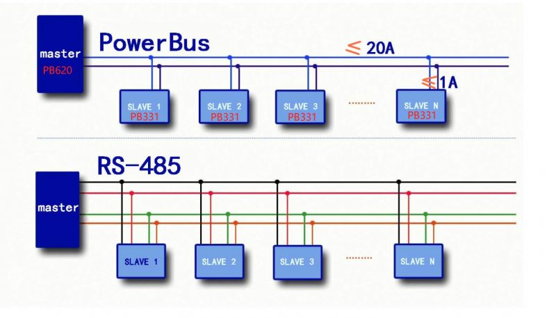

# powerbus-dat

## about powerbus

Intro 

PowerBus is a low-voltage DC carrier power supply bus. It uses full-amplitude voltage transmission and current signal return to provide high communication anti-interference ability. Compared with the RS-485 four-wire system (two power supply lines and two communication lines), the power supply line and the signal line are combined into one, realizing the technology of sharing one bus for signal and power supply. Due to its non-polarity wiring and arbitrary topology performance, it can adapt to various wires used on site and realize the function of long-distance communication. The cable can be laid in any way such as bus type, tree type or star type, which greatly facilitates construction wiring, prevents wrong connection and simplifies construction and maintenance. Design and development personnel only need to focus on protocol layer development, without paying too much attention to transmission physical layer development.

### Technical indicators of PowerBus bus:

- The bus can be powered, and communication and power supply do not require electrical isolation
- Support communication rates of 9600bps and 2400bps half-duplex communication
- Support bus current of 20A (2400bps)
- With bus short-circuit protection, the bus automatically recovers after short-circuit removal
- Fault signal reporting function
- Can connect 256 devices at the same time
- Communication distance can reach 3000m
- Slave station supports non-polarity wiring
- Supports any topology wiring: tree, star, bus type
- Maximum bus voltage can reach 48V
- Use half-duplex communication;
- Working temperature: -40℃~+85℃;

## demo video 

- https://fb.watch/6VirXkBKxN/

in telegram 
- [video 1](https://t.me/electrodragon3/180)
- [video 2](https://t.me/electrodragon3/181)

## boards 

- [[ITF1009-dat]] - [[ITF1014-dat]] - [[ITF1015-dat]]

The communication port of the PowerBus main control board supports switching between TTL and 485, the communication format is (9600, N, 8, 1), the default bus current is 5A (baud rate 9600), and the maximum bus current is supported by shorting the J1 port on the board to 20A (baud rate 2400), and the maximum bus voltage is supported to 48V. It has perfect surge and EMC design, and the maximum communication distance is 3000m. After long-term testing and certification, it works stably and reliably and can be directly applied to engineering. For engineering development and design personnel, there is no need to change any software protocol, and they can freely choose TTL or 485 to communicate with the original master station.

The communication port of the PowerBus daughter board supports switching between TTL and 485, and adapts to the baud rate of the main control board. All wiring is plug-in design. It can provide 5V/12V/24V power supply for the slave station, with a maximum current of 500mA. It supports a maximum bus level of 40V and a maximum communication distance of 3000m. It has no special cable requirements and does not require any software protocol changes when connected to the original network. You can freely choose TTL or 485 to communicate with the original slave.

## Note 

- TTL logic level at 3V3
- baudrate commonly use 9600bps 

## Slave board 

## Master board

## ref 

- [[POWERBUS-PB331.pdf]] - [[POWERBUS-PB620.pdf]]

- https://www.facebook.com/Powerbus1/

- [[mosfet-dat]]

- [[powerbus]]

