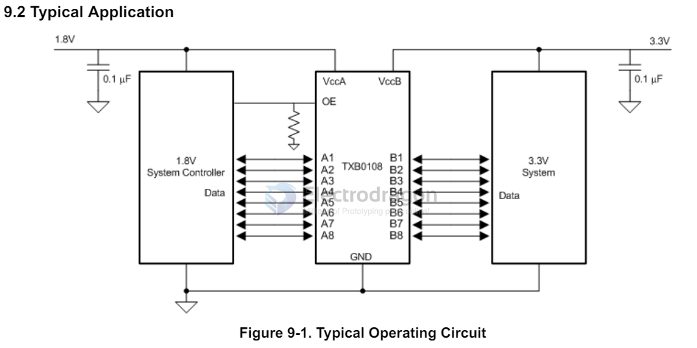

# Logic-shifter-dat

bidirection logic shifter

- [[TXB0108-dat]] - [[TXS0108-dat]] - [[BSS138-dat]] 

one-direction logic shifter

- [[74HCT245-dat]]

## TXB010x VS TXS010x 

For the same reason, the TXB0108 should not be used in applications such as I2C or 1-Wire where an open-drain driver is connected on the bidirectional data I/O. For these applications, use a device from the TI TXS01xx series of level translators.

| Type     | Open-Drive | Push-pull | Examples    |
| -------- | ---------- | --------- | ----------- |
| TXB 010x | ×          |           |             |
| TXS 010x | ✔          |      ✔     | I2C, 1-Wire |

Make sure the VCCA ≤VCCB.

## ref 

- [[logic-shifter]]