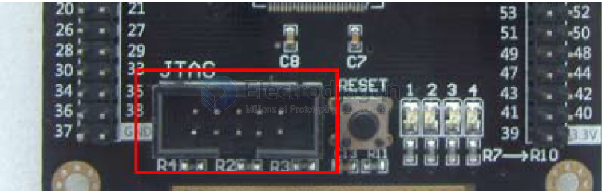
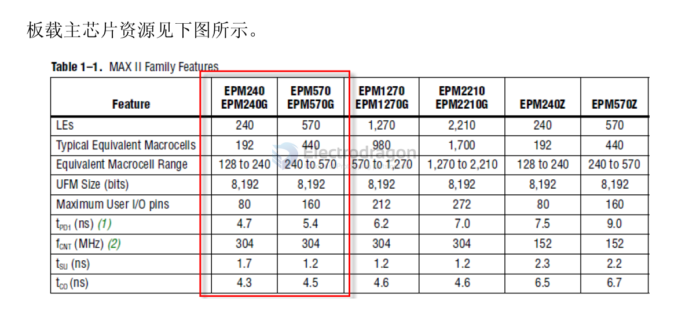

# cpld dat 

## boards 

- [[DODS044-dat]] - [[DODS042-dat]]

https://www.electrodragon.com/w/Altera_CPLD_EPM240_EPM570_Dev._Board

## programmer 

- https://www.electrodragon.com/product/usb-blaster-ed-revsion-altera-cpldfpga-programmer/

- [[DPR1077-dat]]

### JTAG 

do NOT plug the JTAG cable while powering UP !!

## software 

- Quartus 11.0

## chips 

- [[EPM240-dat]] - [[EPM570-dat]]

### Xilinx

* XC9572XL

XILINX - CPLD 

* XC9536xl - 10
* XL9572xl - 12

* XC2C64 - 22
* XC2C32A - 32/44 pin

### Intel / Altera

MAXII is the lowest power, lowest cost CPLD ever - quote from altera website 

* [[EPM240-dat]]
* [[EPM570-dat]]

https://www.altera.com/products/cpld/max-series/max-ii/overview.html

* EPM3032
* EPM3064

- EPM7512AEBI256 == IC CPLD 512MC 10NS 256FBGA

### MAX10 

* max1010m02

### Lattice

* XO3

### AGM

* AG1280Q48
* AG576SL100 - 18

## demo code 

- https://github.com/Edragon/CLPD_SDK

## ref 

- [[CPLD-dat]] - [[FPGA-dat]]