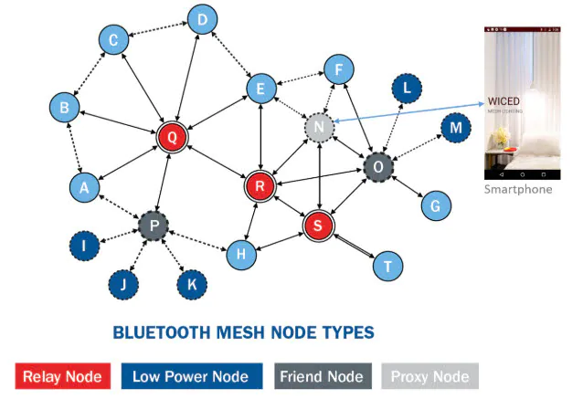
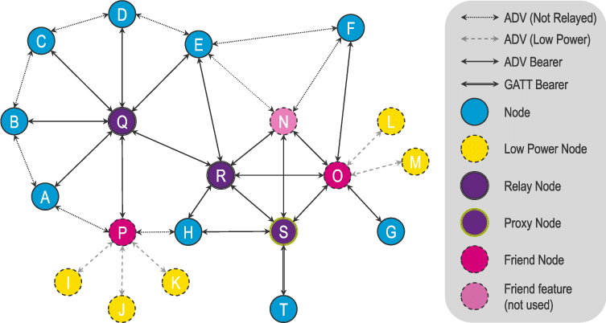

# mesh-node-dat

- Relay nodes: These need to always be awake and therefore consume more power. Relay nodes function to receive and forward message packets across the network. In our lighting example, relay nodes will be mains powered, so it is unlikely they would have energy supply concerns.
- Low-power nodes: These nodes are usually battery powered and are typically in a power-saving sleep mode for the majority of the time.
- Friend nodes: Low-power nodes are always associated with a friend node, which stores and forwards messages according to an agreed schedule. An ambient light sensor used to control outside lights at dusk and dawn is an example of a low-power node.
- Proxy nodes: These nodes enable non-BLE-compliant devices to connect into the mesh through the use of the Bluetooth Generic Attribute (GATT) profile interface.