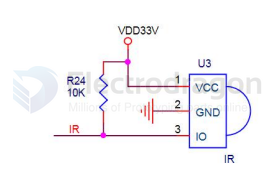
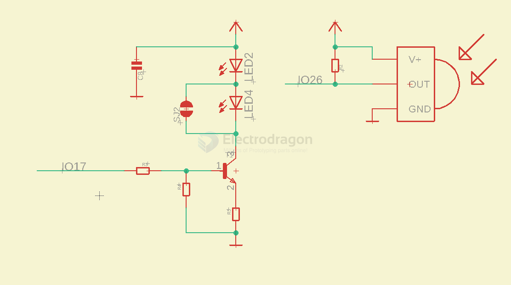

# Infrared 

## APP 

- [[IR-distance-measurer-dat]] - [[line-finder-dat]]

## Boards

- [[SIR1008-dat]] 

arduino shield - [[DAS1013-dat]]

controller - [[SIR1003-dat]]

## RPI-SCH 

- Note RPI signal input better at 3V3 
- refer to board [[MPC1098-dat]]

legacy wiki page - [Infrared for RPI](https://www.electrodragon.com/w/index.php?title=RPI_IR&redirect=no)

## BOM 

- [[infrared-receiver-dat]] - [[infrared-sender-dat]]

## Tutos 

- http://electrodragon.com/?p=1219

## Demo code 

- https://github.com/Edragon/Infrared

- [[IR-rover-rc.ino]]

## ref 

- [[infrared-dat]]

- [Article 2 about IRremote](http://www.arcfn.com/2009/08/multi-protocol-infrared-remote-library.html)

- [How to receive and send](http://www.arcfn.com/2009/08/multi-protocol-infrared-remote-library.html)
  
- [IRremote Library](https://github.com/shirriff/Arduino-IRremote)

