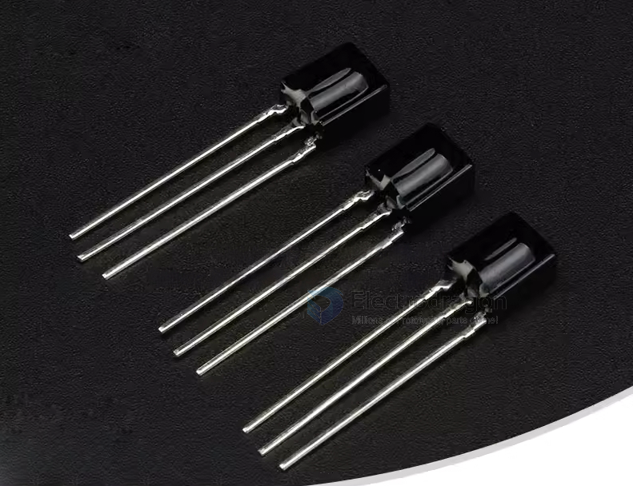
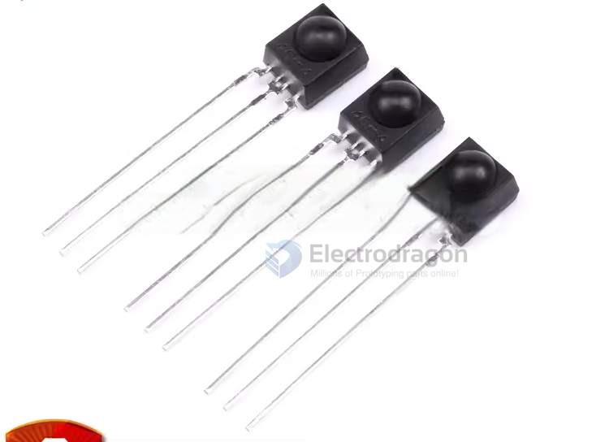
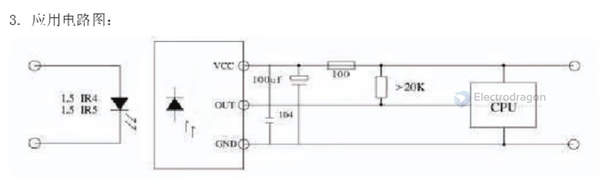
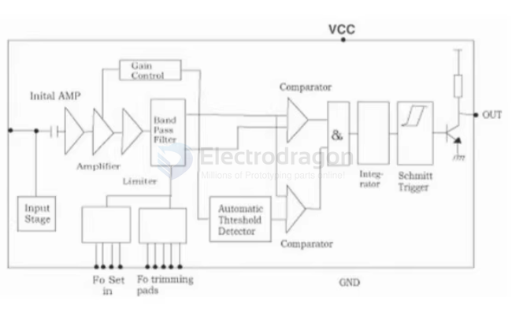
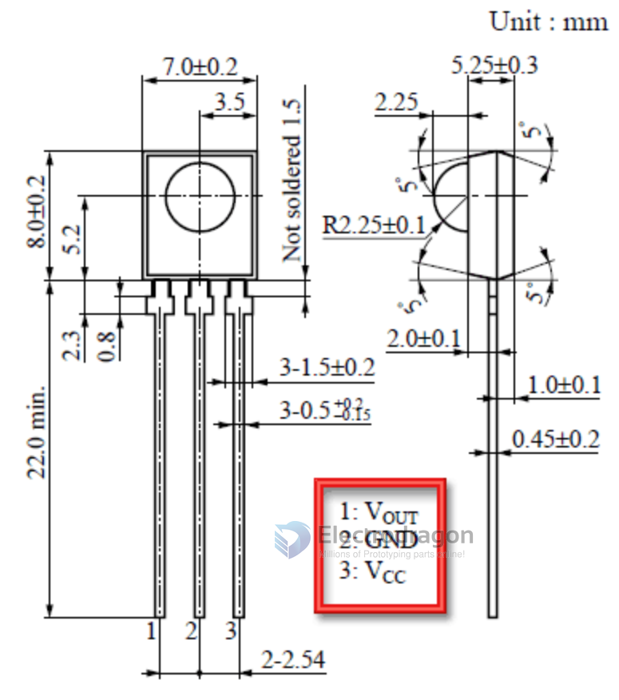
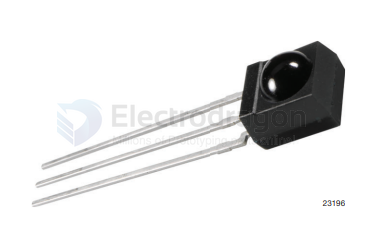
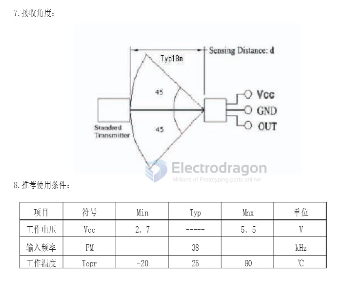
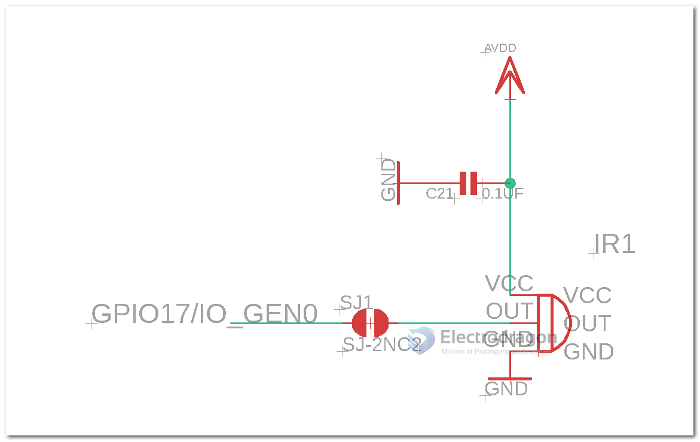

# infrared-receiver

## Common Types 

### 0038 

### 0038-2 

### HX1838 

- HX1838 SCH

Internal diagram of HX1838 

### GP1UX31QS - HS0038 

- DS - [[GP1UX31QS.pdf]]

### Vishay 

TSOP22.., TSOP24.., TSOP48.., TSOP44..

## Params 

## Circuits 

### connecting to RPI 

- connect or disconnect SJ1 to RPI

## ref 

- [[infrared-dat]]