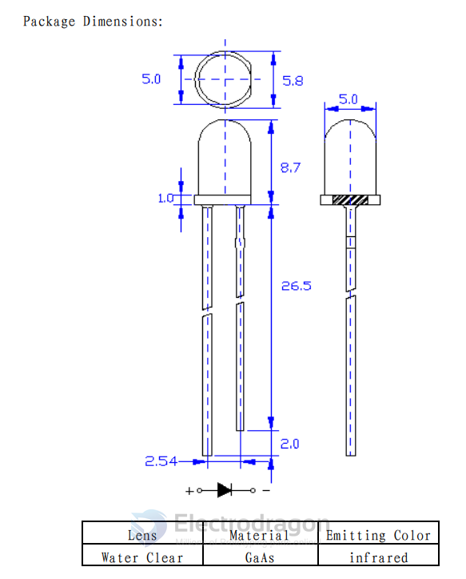
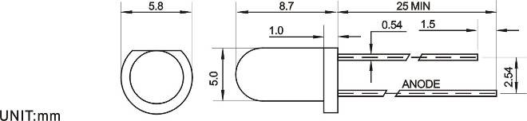
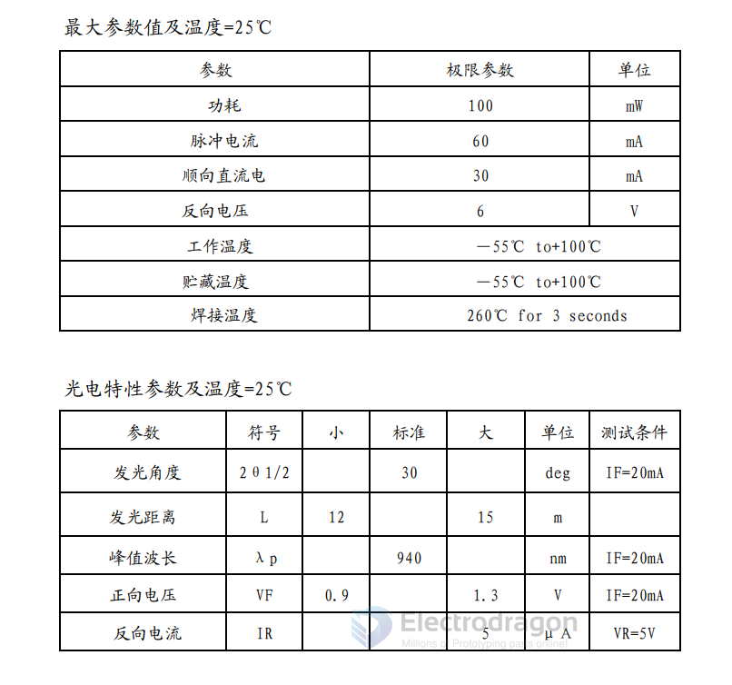
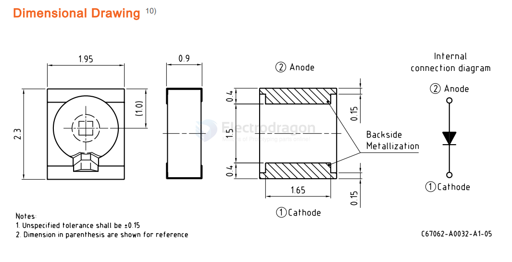

# infrared-sender-dat

## 5mm 940nm common IR sender 

Wavelength: 940nm

Transmission range: This component is an infrared emission tube. 

The emission range is directly related to the sensitivity of the emission drive circuit and reception, so the emission range does not belong to its attributes. 

The empirical value range of this emission tube installed on the remote control is 10m.

Features
- ◇Fast response time
- ◇High photo sensitivity
- ◇Small junction capacitance
- ◇Pb free

Descriptions
- 5003MDis a high speed and high sensitive PIN
- photodiode in a standard 5Φplastic package.
- The device is matched to infrared emitting diode.

 
Applications
- ◇ Infrared applied system.
- ◇ Counters and sorters
- ◇ Encoders
- ◇ Floppy disk drive.
- ◇ Optoelectronic switch
- ◇ Video camera, Tape and card readers
- ◇ Position sensors

## Electro-Optical Characteristics (Ta=25℃)

Parameter	Symbol	Min.	TYP.	Max.	Unit	Condition
- Rang Of Spectral Bandwidth	λ0.5	400	---	1100	nm	---
- Wavelength Of Peak Sensitivity	λP	---	940	---	V	---
- Open-Circuit Voltage	VOC	---	0.39	---	V	Ee=5mW/cm2, λp=940nm
- Short- Circuit Current	ISC	---	35	---	μA	Ee=1mW/cm2, λp=940nm
- Reverse Light Current	IL	25	35	---	μA	Ee=1mW/cm2, λp=940nm, VR=5V
- Reverse Dark Current	ID	---	5	30	nA	Ee=0mW/cm2, VR=10V
- Reverse Breakdown Voltage	BVR	32	170	---	V	Ee=0mW/cm2
- IR=100μA
- Total Capacitance	Ct	---	18	---	pF	Ee=0mW/cm2, VR=5V, f=1MHz
- Rise/Fall Time	tr/tf	---	45/45	---	nS	VR=10V, RL=1000Ω

## unlisted 

### SMD 

[SFH 4441](https://www.mouser.com/datasheet/2/588/SFH_4441_EN-3561587.pdf) == Infrared Emitters Infrared 940nm

