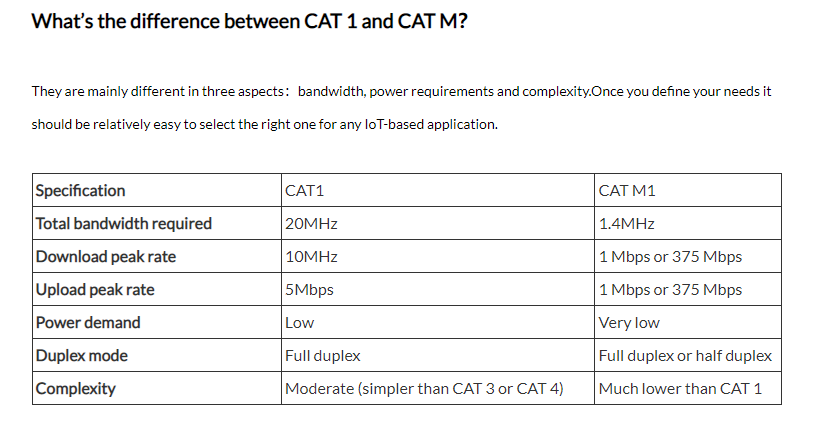

# CAT vs. CAT M

## supported by countries 

network check by here: https://www.frequencycheck.com/countries

| Country                      | Bands Count | B1 | B3 | B4 | B5 | B7 | B8 | B20 | B28 | B40 | B41 | Other Bands                               | Coverage |
| ---------------------------- | ----------- | -- | -- | -- | -- | -- | -- | --- | --- | --- | --- | ----------------------------------------- | -------- |
| United States                | 12          |    |    | X  | X  |    |    |     |     |     | X   | B2 B12 B13 B17 B25 B26 B30 B66 B71        | 97.10%   |
| Canada                       | 9           |    |    | X  | X  | X  |    |     |     |     |     | B2 B12 B13 B17 B29 B66                    | 91.90%   |
| Japan                        | 8           | X  |    |    |    |    | X  |     | X   |     | X   | B18 B21 B9 B11                            | 100%     |
| Australia                    | 6           | X  | X  |    | X  | X  |    |     | X   | X   |     |                                           | 88.50%   |
| China                        | 5           |    | X  |    |    |    |    |     |     | X   | X   | B38 B39                                   | 82.50%   |
| Philippines                  | 5           | X  | X  |    | X  | X  |    |     |     |     | X   |                                           | 80.50%   |
| France                       | 5           | X  | X  |    |    | X  |    | X   | X   |     |     |                                           | 89.10%   |
| South Korea                  | 5           | X  | X  |    | X  | X  | X  |     |     |     |     |                                           | 99.20%   |
| Sweden                       | 5           |    | X  |    |    | X  | X  | X   |     |     |     | B38                                       | 90.10%   |
| Czech Republic               | 5           | X  | X  |    |    | X  | X  | X   |     |     |     |                                           | 91.90%   |
| Indonesia                    | 4           |    | X  |    | X  |    | X  |     |     | X   |     |                                           | 77.60%   |
| United Kingdom               | 4           | X  | X  |    |    | X  |    | X   |     |     |     |                                           | 91.30%   |
| Poland                       | 4           | X  | X  |    |    |    |    | X   |     |     |     | B38                                       | 89.10%   |
| Saudi Arabia                 | 4           | X  | X  |    |    |    |    |     |     | X   |     | B38                                       | 79.20%   |
| Taiwan                       | 4           |    | X  |    |    | X  | X  |     | X   |     |     |                                           | 94.50%   |
| Romania                      | 4           |    | X  |    |    | X  |    | X   |     |     |     | B38                                       | 86.60%   |
| Netherlands                  | 4           |    | X  |    |    | X  | X  | X   |     |     |     |                                           | 96.60%   |
| Hong Kong                    | 4           |    | X  |    |    | X  | X  |     |     | X   |     |                                           | 93.80%   |
| Puerto Rico                  | 4           |    |    | X  |    |    |    |     |     |     |     | B13 B17 B25                               | 89.80%   |
| Slovenia                     | 4           |    | X  |    |    | X  | X  | X   |     |     |     |                                           | 88%      |
| Estonia                      | 4           | X  | X  |    |    | X  |    | X   |     |     |     |                                           | 92.90%   |
| Guam                         | 4           |    |    | X  |    |    |    |     |     |     |     | B2 B12 B17                                |          |
| India                        | 3           |    | X  |    | X  |    |    |     |     | X   |     |                                           | 80.60%   |
| Bangladesh                   | 3           | X  | X  |    |    |    | X  |     |     |     |     |                                           | 66.70%   |
| Russia                       | 3           |    | X  |    |    | X  |    | X   |     |     |     |                                           | 79.10%   |
| Iran                         | 3           |    | X  |    |    | X  |    |     |     | X   |     |                                           |          |
| Germany                      | 3           |    | X  |    |    | X  |    | X   |     |     |     |                                           | 92.50%   |
| South Africa                 | 3           | X  | X  |    |    |    |    |     |     | X   |     |                                           | 83.10%   |
| Italy                        | 3           |    | X  |    |    | X  |    | X   |     |     |     |                                           | 90.10%   |
| Uganda                       | 3           |    | X  |    |    | X  |    | X   |     |     |     |                                           |          |
| Bolivia                      | 3           |    |    | X  |    |    |    |     |     |     |     | B13 B17                                   | 58.40%   |
| Dominican Republic           | 3           |    | X  | X  |    |    |    |     |     |     |     | B2                                        | 78.40%   |
| United Arab Emirates         | 3           |    | X  |    |    | X  |    | X   |     |     |     |                                           | 91.50%   |
| Tajikistan                   | 3           |    | X  |    |    | X  |    | X   |     |     |     |                                           |          |
| Portugal                     | 3           |    | X  |    |    | X  |    | X   |     |     |     |                                           | 87.20%   |
| Greece                       | 3           |    | X  |    |    | X  |    | X   |     |     |     |                                           | 86.90%   |
| Hungary                      | 3           |    | X  |    |    | X  |    | X   |     |     |     |                                           | 90%      |
| Austria                      | 3           |    | X  |    |    | X  |    | X   |     |     |     |                                           | 88.80%   |
| Switzerland                  | 3           |    | X  |    |    | X  |    | X   |     |     |     |                                           | 94.60%   |
| Denmark                      | 3           |    | X  |    |    | X  |    | X   |     |     |     |                                           | 94.80%   |
| Singapore                    | 3           |    | X  |    |    | X  | X  |     |     |     |     |                                           | 94.10%   |
| Finland                      | 3           |    | X  |    |    | X  |    | X   |     |     |     |                                           | 92.50%   |
| Norway                       | 3           |    | X  |    |    | X  |    | X   |     |     |     |                                           | 94.10%   |
| Slovakia                     | 3           |    | X  |    |    | X  |    | X   |     |     |     |                                           | 88.90%   |
| Qatar                        | 3           |    | X  |    |    | X  |    | X   |     |     |     |                                           | 91.90%   |
| Moldova                      | 3           |    | X  |    |    | X  |    | X   |     |     |     |                                           | 68.40%   |
| Lithuania                    | 3           |    | X  |    |    | X  |    | X   |     |     |     |                                           | 93.10%   |
| Latvia                       | 3           |    | X  |    |    | X  |    | X   |     |     |     |                                           | 88.40%   |
| Belize                       | 3           |    |    |    | X  |    |    |     |     |     |     | B2 B13 (700 c)                            |          |
| Jersey                       | 3           |    | X  |    |    | X  |    | X   |     |     |     |                                           |          |
| San Marino                   | 3           |    | X  |    |    | X  |    | X   |     |     |     |                                           |          |
| Pakistan                     | 2           |    | X  |    | X  |    |    |     |     |     |     |                                           | 75.90%   |
| Brazil                       | 2           |    | X  |    |    | X  |    |     |     |     |     |                                           | 67.50%   |
| Mexico                       | 2           |    |    | X  |    |    |    |     |     |     |     | B2                                        | 73%      |
| Kenya                        | 2           |    | X  |    |    |    |    | X   |     |     |     |                                           | 65.90%   |
| Colombia                     | 2           |    |    | X  |    | X  |    |     |     |     |     |                                           | 63.10%   |
| Spain                        | 2           |    | X  |    |    | X  |    |     |     |     |     |                                           | 84.60%   |
| Morocco                      | 2           |    | X  |    |    |    |    | X   |     |     |     |                                           | 79.70%   |
| Malaysia                     | 2           |    | X  |    |    | X  |    |     |     |     |     |                                           | 81.70%   |
| Peru                         | 2           |    |    | X  |    |    |    |     |     |     |     | B2                                        | 72.50%   |
| Venezuela                    | 2           |    | X  | X  |    |    |    |     |     |     |     |                                           |          |
| Sri Lanka                    | 2           |    | X  |    |    |    |    |     |     | X   |     |                                           | 77.80%   |
| Chile                        | 2           |    |    | X  |    | X  |    |     |     |     |     |                                           | 70.50%   |
| Guatemala                    | 2           |    |    |    | X  |    |    |     |     |     |     | B2                                        | 76.70%   |
| Ecuador                      | 2           |    |    | X  |    |    |    |     |     |     |     | B2                                        | 57.70%   |
| Cambodia                     | 2           |    | X  |    | X  |    |    |     |     |     |     |                                           | 81.80%   |
| Belgium                      | 2           |    | X  |    |    |    |    | X   |     |     |     |                                           | 94.40%   |
| Belarus                      | 2           |    | X  |    |    | X  |    |     |     |     |     |                                           | 48%      |
| Paraguay                     | 2           |    |    | X  |    |    |    |     |     |     |     | B2                                        | 67.90%   |
| Oman                         | 2           |    | X  |    |    |    |    |     |     | X   |     |                                           | 76.90%   |
| Ireland                      | 2           |    | X  |    |    |    |    | X   |     |     |     |                                           | 76.90%   |
| New Zealand                  | 2           |    | X  |    |    |    |    |     | X   |     |     |                                           | 81%      |
| Costa Rica                   | 2           |    | X  |    |    | X  |    |     |     |     |     |                                           | 69.50%   |
| Kuwait                       | 2           |    | X  |    |    |    |    | X   |     |     |     |                                           | 71.80%   |
| Panama                       | 2           |    |    |    |    |    |    |     | X   |     |     | B2                                        | 73%      |
| Croatia                      | 2           |    | X  |    |    |    |    | X   |     |     |     |                                           | 85.40%   |
| Georgia                      | 2           |    | X  |    |    |    |    | X   |     |     |     |                                           | 83.40%   |
| Uruguay                      | 2           |    |    | X  |    |    |    |     |     |     |     | B2                                        | 70.40%   |
| Albania                      | 2           |    | X  |    |    | X  |    |     |     |     |     |                                           | 79.40%   |
| Fiji                         | 2           |    | X  |    |    |    |    | X   |     |     |     |                                           |          |
| Macau                        | 2           |    | X  |    |    |    |    |     |     | X   |     | (1800 +)                                  |          |
| Montenegro                   | 2           |    | X  |    |    | X  |    |     |     |     |     |                                           |          |
| Maldives                     | 2           |    | X  |    |    | X  |    |     |     |     |     |                                           |          |
| Iceland                      | 2           |    | X  |    |    |    |    | X   |     |     |     |                                           | 86%      |
| Isle of Man                  | 2           |    | X  |    |    |    |    | X   |     |     |     |                                           |          |
| Cayman Islands               | 2           |    | X  |    |    |    |    |     |     |     |     | B17                                       |          |
| Dominica                     | 2           |    |    | X  |    |    |    |     |     |     |     | B17                                       |          |
| Gibraltar                    | 2           |    |    |    |    | X  |    | X   |     |     |     |                                           |          |
| Monaco                       | 2           |    |    |    |    | X  |    | X   |     |     |     |                                           |          |
| Ethiopia                     | 1           |    | X  |    |    |    |    |     |     |     |     |                                           |          |
| Thailand                     | 1           | X  |    |    |    |    |    |     |     |     |     |                                           | 83.30%   |
| Tanzania                     | 1           |    |    |    |    |    |    | X   |     |     |     |                                           |          |
| Sudan                        | 1           | X  |    |    |    |    |    |     |     |     |     |                                           |          |
| Algeria                      | 1           |    | X  |    |    |    |    |     |     |     |     |                                           | 58.40%   |
| Argentina                    | 1           |    |    | X  |    |    |    |     |     |     |     |                                           | 74.90%   |
| Angola                       | 1           |    | X  |    |    |    |    |     |     |     |     |                                           |          |
| Ukraine                      | 1           |    |    |    |    | X  |    |     |     |     |     |                                           | 67.30%   |
| Uzbekistan                   | 1           |    |    |    |    | X  |    |     |     |     |     |                                           | 69.80%   |
| Zambia                       | 1           |    | X  |    |    |    |    |     |     |     |     |                                           | 64.70%   |
| Kazakhstan                   | 1           |    | X  |    |    |    |    |     |     |     |     |                                           | 71%      |
| Zimbabwe                     | 1           |    | X  |    |    |    |    |     |     |     |     |                                           |          |
| Jordan                       | 1           |    | X  |    |    |    |    |     |     |     |     |                                           | 71%      |
| Honduras                     | 1           |    |    | X  |    |    |    |     |     |     |     |                                           | 69.50%   |
| Papua New Guinea             | 1           |    |    |    |    |    |    |     | X   |     |     |                                           |          |
| Azerbaijan                   | 1           |    | X  |    |    |    |    |     |     |     |     |                                           | 75.70%   |
| Israel                       | 1           |    | X  |    |    |    |    |     |     |     |     |                                           | 81.80%   |
| Laos                         | 1           |    | X  |    |    |    |    |     |     |     |     |                                           |          |
| Turkmenistan                 | 1           |    |    |    |    | X  |    |     |     |     |     |                                           |          |
| Kyrgyzstan                   | 1           |    |    |    |    | X  |    |     |     |     |     |                                           | 87.20%   |
| Nicaragua                    | 1           |    |    | X  |    |    |    |     |     |     |     |                                           | 64.20%   |
| Bulgaria                     | 1           |    | X  |    |    |    |    |     |     |     |     |                                           | 86%      |
| Serbia                       | 1           |    | X  |    |    |    |    |     |     |     |     |                                           | 84.30%   |
| Lebanon                      | 1           |    | X  |    |    |    |    |     |     |     |     |                                           | 79.30%   |
| Namibia                      | 1           |    | X  |    |    |    |    |     |     |     |     |                                           |          |
| Armenia                      | 1           |    |    |    |    | X  |    |     |     |     |     |                                           |          |
| Jamaica                      | 1           |    |    |    | X  |    |    |     |     |     |     |                                           | 67.50%   |
| Lesotho                      | 1           |    |    |    |    |    |    | X   |     |     |     |                                           |          |
| Bahrain                      | 1           |    | X  |    |    |    |    |     |     |     |     |                                           | 89.50%   |
| Trinidad and Tobago          | 1           |    |    |    |    | X  |    |     |     |     |     |                                           |          |
| Cyprus                       | 1           |    | X  |    |    |    |    |     |     |     |     |                                           | 92.10%   |
| Mauritius                    | 1           |    | X  |    |    |    |    |     |     |     |     |                                           |          |
| Bhutan                       | 1           |    | X  |    |    |    |    |     |     |     |     |                                           |          |
| Luxembourg                   | 1           |    | X  |    |    |    |    |     |     |     |     |                                           | 82.70%   |
| Malta                        | 1           |    | X  |    |    |    |    |     |     |     |     |                                           |          |
| Brunei                       | 1           |    | X  |    |    |    |    |     |     |     |     |                                           |          |
| Bahamas                      | 1           |    |    |    |    |    |    |     |     |     |     | B17                                       |          |
| Vanuatu                      | 1           |    |    |    |    |    |    |     |     | X   |     |                                           |          |
| Kiribati                     | 1           |    |    |    |    |    |    |     |     |     |     | B12                                       |          |
| Seychelles                   | 1           |    |    |    |    |    |    | X   |     |     |     |                                           |          |
| Aruba                        | 1           |    | X  |    |    |    |    |     |     |     |     |                                           |          |
| United States Virgin Islands | 1           |    |    | X  |    |    |    |     |     |     |     |                                           |          |
| Greenland                    | 1           |    |    |    |    |    |    | X   |     |     |     |                                           |          |
| Turks and Caicos Islands     | 1           |    |    |    |    |    |    |     |     |     |     | B17                                       |          |
| Northern Mariana Islands     | 1           |    |    |    |    |    |    |     |     |     |     | B12                                       |          |
| Liechtenstein                | 1           |    |    |    |    |    |    | X   |     |     |     |                                           |          |
| Nigeria                      |             |    |    |    |    |    |    |     |     |     |     |                                           | 62.60%   |
| Egypt                        |             |    |    |    |    |    |    |     |     |     |     |                                           | 74.10%   |
| Vietnam                      |             |    |    |    |    |    |    |     |     |     |     |                                           | 80.70%   |
| Turkey                       |             |    |    |    |    |    |    |     |     |     |     |                                           | 79.30%   |
| Myanmar                      |             |    |    |    |    |    |    |     |     |     |     |                                           | 76.90%   |
| Iraq                         |             |    |    |    |    |    |    |     |     |     |     |                                           | 63.30%   |
| Ghana                        |             |    |    |    |    |    |    |     |     |     |     |                                           | 56.80%   |
| Ivory Coast                  |             |    |    |    |    |    |    |     |     |     |     |                                           | 55%      |
| Nepal                        |             |    |    |    |    |    |    |     |     |     |     |                                           | 61%      |
| Senegal                      |             |    |    |    |    |    |    |     |     |     |     |                                           | 54.40%   |
| Tunisia                      |             |    |    |    |    |    |    |     |     |     |     |                                           | 70.40%   |
| El Salvador                  |             |    |    |    |    |    |    |     |     |     |     |                                           | 71.30%   |
| Mongolia                     |             |    |    |    |    |    |    |     |     |     |     |                                           | 67.10%   |
| North Macedonia              |             |    |    |    |    |    |    |     |     |     |     |                                           | 86%      |

## ref 
https://www.inhandnetworks.com/lte-cat-1-vs-cat-m1.html