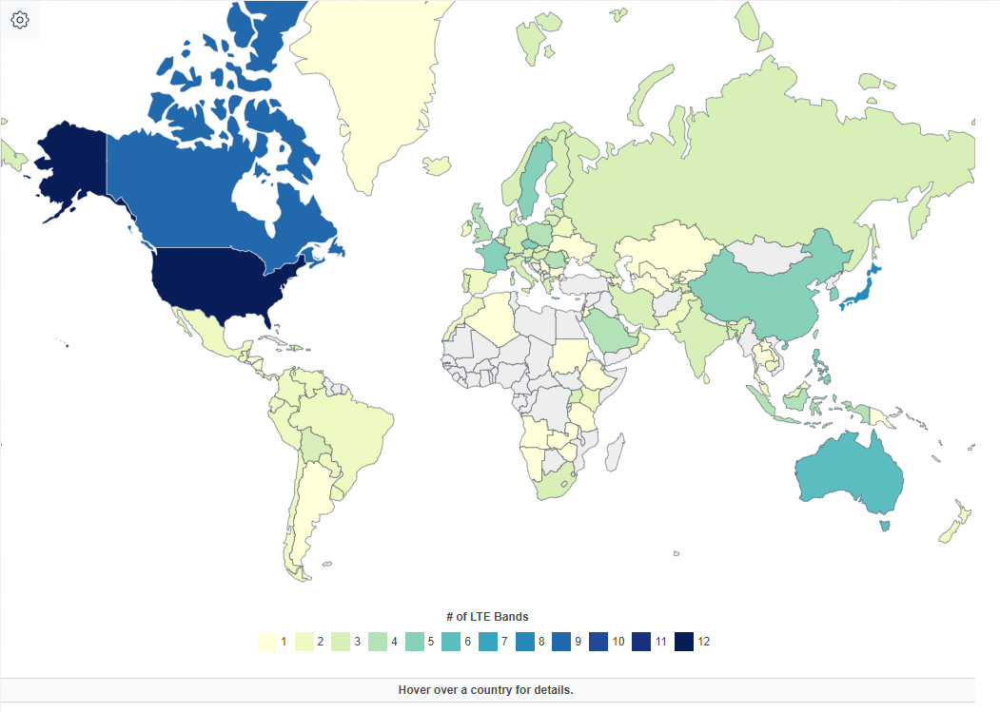
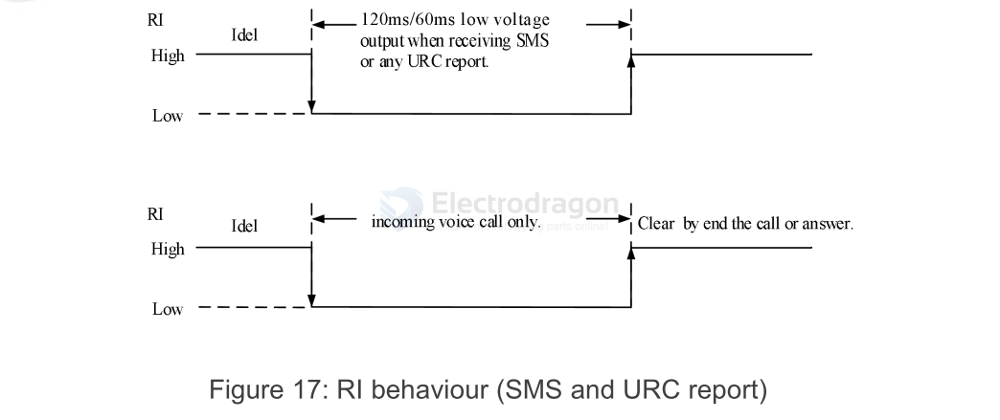

# M2M-dat

- 2G
- LWPA

- CAT1
- CAT4
- [[NBIOT-dat]]

LTE FDD B1/B3/B5/B8
LTE FDD B1/B3/B5/B7/B8
LTE FDD B1/B3/B5/B7/B8/B20/B28
LTE TDD B34/B38/B39/B40/B41

- Frequency-division duplexing (FDD); 
- time-division duplexing (TDD)

CAT-M
CAT-NB

## Tech by Types 

| Module        | Network    | Boards          |
| ------------- | ---------- | --------------- |
| [[A7670-dat]] | [[4G-dat]] | [[NGS1131-dat]] |
| [[EC20-dat]]  | [[4G-dat]] | [[NGS1108-dat]] |

## NBIOT 

LTE Cat NB1, 

also known as Narrowband IoT (NB-IoT) is a Low Power Wide Area (LPWA) technology that has been developed to enable a wide range of devices to be connected to the internet using existing mobile networks. NB-IoT has been developed to enable the Internet of Things (IoT). It is a low power, narrowband technology that can support small amounts of 2-way data transmission in an efficient, secure, and reliable manner. This standard was created in **3GPP Release 13**.

LTE Cat NB2 

is an upgraded version of the LTE Cat NB1 standard (NB-IoT). **In Release 14**, 3GPP introduced an enhanced NB-IoT protocol and a new device category called NB2. 

This standard is an upgraded version of the LTE Cat NB1 standard.

LTE NB1 vs LTE NB2

| Features               | LTE Cat NB1 | LTE Cat NB2    |
| ---------------------- | ----------- | -------------- |
| 3GPP Release           | Release 13  | Release 14     |
| Channel Bandwidth      | 180 kHz     | 180 kHz        |
| UE Bandwidth           | 200 kHz     | 200 kHz        |
| Transmission Duplexity | Half        | Half           |
| Max Tx Power           | 20, 23 dBm  | 14, 20, 23 dBm |
| Max Downlink data rate | ~26 kbps    | ~127 kbps      |
| Max Uplink data rate   | ~62 kbps    | ~159 kbps      |
| Latency                | <10 sec     | -              |
| Data Encryption        | EPS-AKA     | EPS-AKA        |
| Device Authentication  | SIM         | SIM            |
| Voice Support          | No          | No             |
| Positioning            | Cell ID     | OTDOA, E-CID   |

## CAT-M

CAT-M (also known as LTE-M or LTE Cat-M1) can operate in both Frequency Division Duplex (FDD) and Time Division Duplex (TDD) modes. The choice between FDD and TDD for CAT-M depends on the specific network deployment and regional spectrum regulations.

### Overview
Frequency Division Duplex (FDD): Uses separate frequencies for uplink and downlink. It allows for simultaneous transmission and reception.

Time Division Duplex (TDD): Uses the same frequency for both uplink and downlink but alternates in time. Transmission and reception occur at different times on the same frequency.

### CAT-M Characteristics
Compatibility: CAT-M is designed to be compatible with existing LTE infrastructure, so it can utilize FDD, which is more commonly used in LTE networks.

Flexibility: CAT-M also supports TDD for regions or deployments where TDD is preferred or necessary due to spectrum availability or regulatory reasons.

### Practical Use
FDD: Predominantly used in regions where FDD LTE networks are prevalent. Common in many parts of the world due to existing LTE deployments.

TDD: Used in regions or specific cases where TDD LTE networks are implemented, offering flexibility in spectrum usage and often used in China and some other areas.

If you're deploying or using CAT-M technology, check with the specific network provider or region's spectrum regulations to understand which mode is supported.

## FDD vs TDD 

- https://en.wikipedia.org/wiki/LTE_frequency_bands
- TDD mainly located at 34 ~ 54

## Support 

- check supported countries by here: https://en.wikipedia.org/wiki/List_of_LTE_networks
- check by sepcific country: https://www.frequencycheck.com/countries
- interactive map: https://worldpopulationreview.com/country-rankings/lte-bands-by-country

## Functions 

LBS = Base station location, AT+CLBS 

### RI (ring) and DTR Behavior

RI usually keeps high level output. When receiving a short message or URC report, RI outputs a low level for 120ms (short message)/60ms (URC), and then returns to a high-level state; RI will output a low level, when receiving a phone call as the called party. 

After outputting low level, RI will remain low until the host accepts the call using the "ATA" command or the caller stops calling RI, in the end, it will become high level.

**DTR for sleep mode**

After setting the AT command “AT+CSCLK=1”, and then pulling up the DTR pin, Module will enter sleep mode when module is in idle mode. In sleep mode, the UART is unavailable. When A7672X/ enters sleep mode, pulling down DTR can wakeup module.

After setting the AT command “AT+CSCLK=0”, A7672X/A7670X Series will do nothing when the DTR pin is
pulling up.

### USB Interface

The A7672X/7670X contains a USB interface compliant with the USB2.0 specification as a peripheral, but does not support USB charging function and does not support USB HOST mode.

### GNSS 

GNSS_VBKP = GNSS VRTC power input, input voltage 1.4V~3.6V

| Pin name    | Pin No. | Power domain | Type | Description                                                           | Note                                                                           |
| ----------- | ------- | ------------ | ---- | --------------------------------------------------------------------- | ------------------------------------------------------------------------------ |
| GNSS_PWRCTL | 98      | 1.8V         | DI   | The enable control PIN ofGNSS power supply.                           | Active high.                                                                   |
| 1V8_GNSS    | 97      | -            | PI   | The power input for GNSS,the input voltage must notbe less than 1.8V. | Module VDD_1V8(PIN 15) can be usedfor this power supply                        |
| GNSS_VBKP   | 116     | -            | PI   | GNSS VRTC power input,input voltage 1.4V~3.6V                         | If unused, keep itopen.                                                        |
| 1PPS        | 100     | 1.8V         | DO   | 1PPS signal output                                                    | If unused, keep itopen.                                                        |
| GNSS_RXD    | 96      | 1.8V         | DI   | GNSS UART RX                                                          | Connect to MCUUART_TX;Or use 1K resistors inseries in moduleUART3_TX (pin 50). |
| GNSS_TXD    | 95      | 1.8V         | DO   | GNSS UART TX                                                          | Connect to MCUUART_RX;Or use 1K resistors inseries in moduleUART3_RX (pin 49). |

## Module manufacturer

- [[fibocom-dat]] - [[simcom-dat]] - [[quectel-dat]]

## ref 

- [[M2M]]