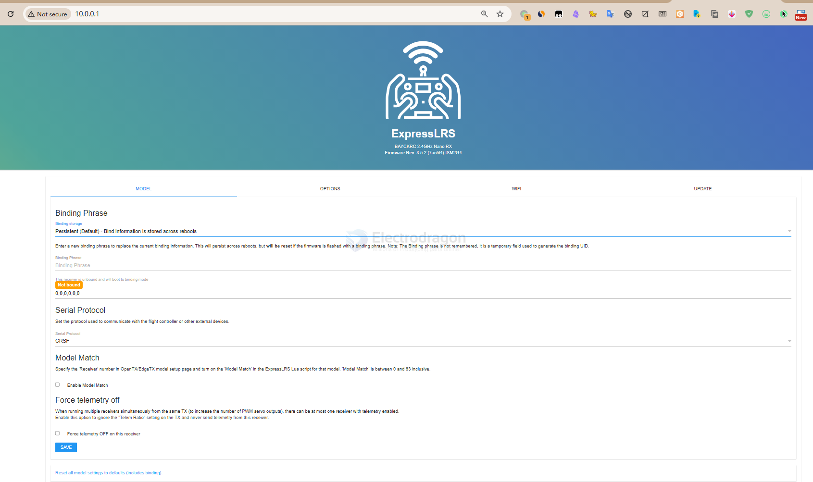
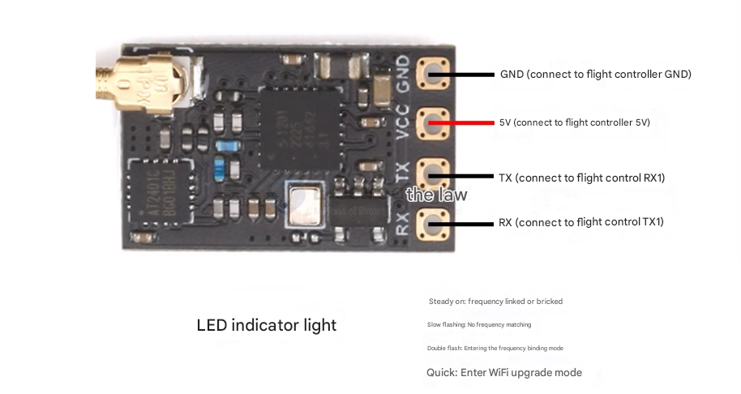
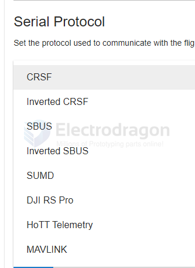

# ELRS-RX-dat

## T-anntena version 

- [[antenna-dat]]

## SMD antenna version 

## info 

Nano2400-RX receiver with power amplifier (PA+LNA).

Therefore, it has 100mW telemetry output and better sensitivity at longer distances.

It uses an IPEX1 antenna connector.

Paired with an external dipole T-antenna (customized by a professional factory, each antenna is tested with professional instruments to ensure quality, lightness, and durability).

The CYCLONE series receivers are based on the open-source architecture and program of ExpressLRS.

We have released 3 types of RX receiver modules. All use the [[ESP8285-dat]] [[MCU-dat]]. You can upgrade the firmware via [[WIFI-dat]], which is very user-friendly.

## hotspot 

Typically, after powering the receiver and with the remote controller turned off, the ExpressLRS hotspot can be found after a default of 60 seconds. Connect to this hotspot using a computer or mobile phone.

The password is "expresslrs", and then you can access 10.0.0.1 to upload the receiver firmware.

## serial 

Runtime Options

This form overrides the options provided when the firmware was flashed. These changes will persist across reboots, but will be reset when the firmware is reflashed.

WiFi auto on" interval in seconds (leave blank to disable) == 60
UART baud == 420000 = 420K

## Product Features

-   High refresh rate 100mW telemetry output;
-   Supports convenient and fast firmware flashing via WIFI connection;
-   Firmware Version: 3.3.0 [BETAFPVLite2400RX]
-   Equipped with a power amplifier (PA+LNA), providing 100mW telemetry output and better response speed;
-   Theoretically compatible with most ELRS 2.4G transmitter modules on the market (requires firmware version 2.0 or above).

## supported modules 

## FAQ

1.  **Q: Can this receiver be bound to a XXX brand's high-frequency head (transmitter module)?**
    A: The ELRS project is open source. Therefore, as long as the high-frequency head uses the ELRS protocol, regardless of the brand, it can be bound. However, three conditions must be met:
    *   The frequency must be the same, either both 2.4G or both 915MHz.
    *   The firmware version must be consistent. For example, if the high-frequency head is flashed with firmware version 2.5.0, the receiver must also be flashed with firmware version 2.5.0.
    *   Either both have no binding phrase, or both have the same binding phrase set.

2.  **Q: How do I enter binding mode?**
    A: After soldering the receiver, quickly power cycle the aircraft three times. That is: power on then immediately power off, power on then immediately power off, power on and leave it on. The interval between power cycles should be within 1.5 seconds. If done correctly, the receiver's LED will flash rapidly twice in a cycle, indicating it is in binding mode. At this time, press the bind button in the remote controller's script. If binding is successful, the receiver's LED will turn solid.

3.  **Q: I'm using my receiver for the first time, why can't I enter binding mode? The light stays solid. What's wrong?**
    A: We have encountered similar issues in after-sales support. We found that some flight controllers have abnormal TX/RX ports, causing the receiver to enter bootloader/flash mode upon power-up. In this case, simply changing to a different TX/RX port on the flight controller can solve the problem.

4.  **Q: Why is my receiver's light always flashing rapidly?**
    A: If you power on the receiver and it does not enter binding mode, or if it's already bound but the remote controller is not turned on, the receiver will enter WiFi flashing mode after 60 seconds without a signal, and the indicator light will flash rapidly.

5.  **Q: How do I enter WiFi flashing mode to flash firmware to the receiver?**
    A: Same as the answer above. Power on the receiver and leave it. It will automatically enter WiFi flashing mode in about 60 seconds, and the light will flash rapidly.

## Versions 

- Firmware Rev. 3.5.2 (7ac5f4)

## ref 

- [[ELRS-dat]]