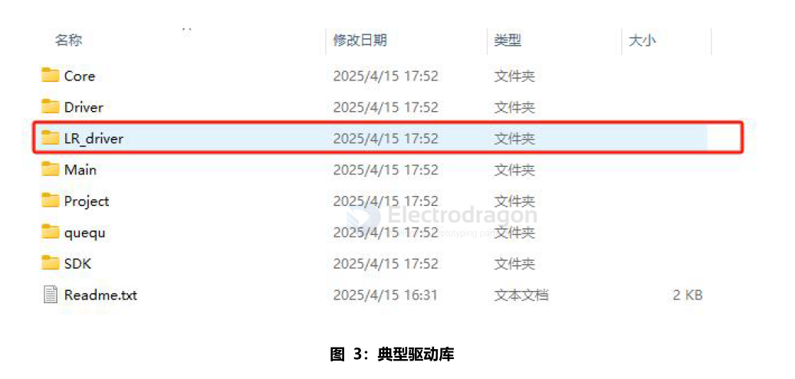

# Lora-SDK-dat

## stm32 code 

路径：LR_driversrc中的文件就是lora的驱动，该驱动为在semtech下载的驱动文件，仅做了对STM32F103适配HAL库的修改，其他未做改动。

其中的sx126xhal.c文件为直接与LORA模组进行数据交互和控制的文件，移植时理论上只要修改这一部分即可适配到新的IC上。

路径：LR_driver下的UserConfig.c/文件是在适配IC驱动时产生的公共文件，包括一些SPl，dio1引脚等的一些配置，移植时进行修改即可使用。

- Core：从SDK抽取的核心文件，方便修改
- Driver：用户编写的外设驱动文件
- LR_driver:lora（LLCC68，SX1262公用）射频驱动文件，当前为Semtech官网下载
- Main：主函数文件，及配置文件
- Project：工程文件，包含目标二进制文件
- queue：该文件为队列spi接口，添加路径和引l用即可调用，demo用于UART的数据处理
- SDK：CMSIS和HAL库，只包含用到的库，添加其它外设需要添加相应库
- Readme.txt：工程说明文件

## code 

- info for EE22, EE32, EE2 == https://github.com/Edragon/lora
- lora2 designs == https://github.com/Edragon/Lora2
- https://github.com/Edragon/alios-asr-lora

## ref 

- [[lora-dat]]